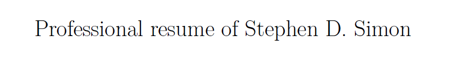
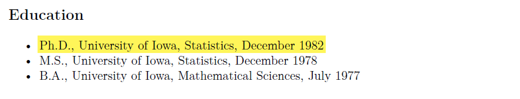
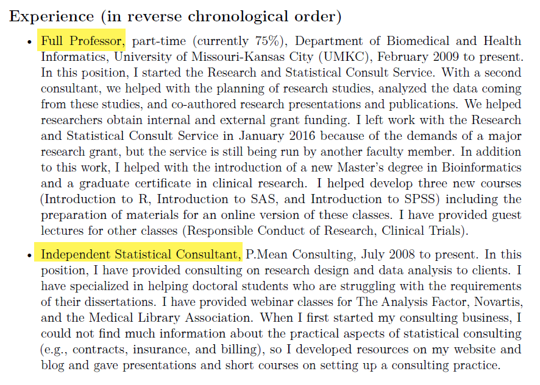
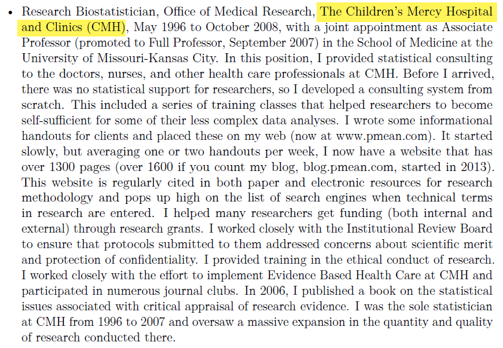
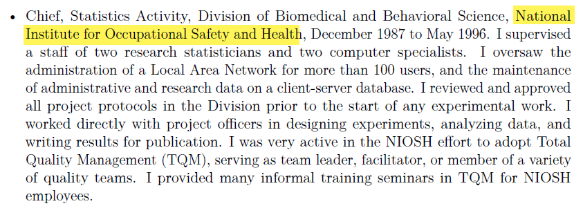
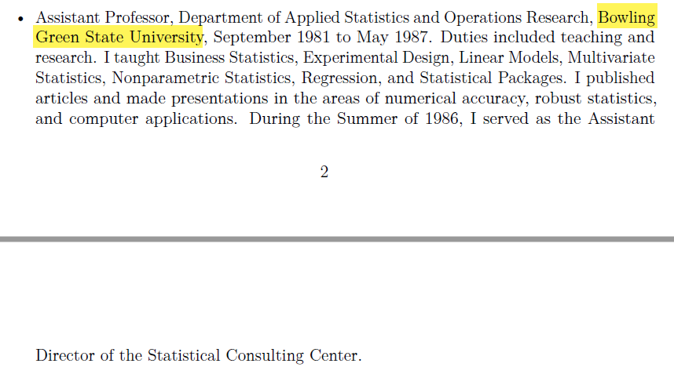
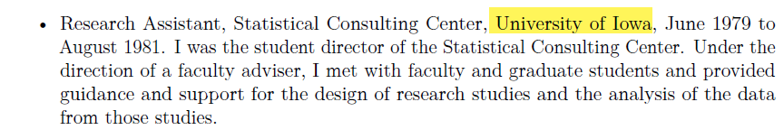
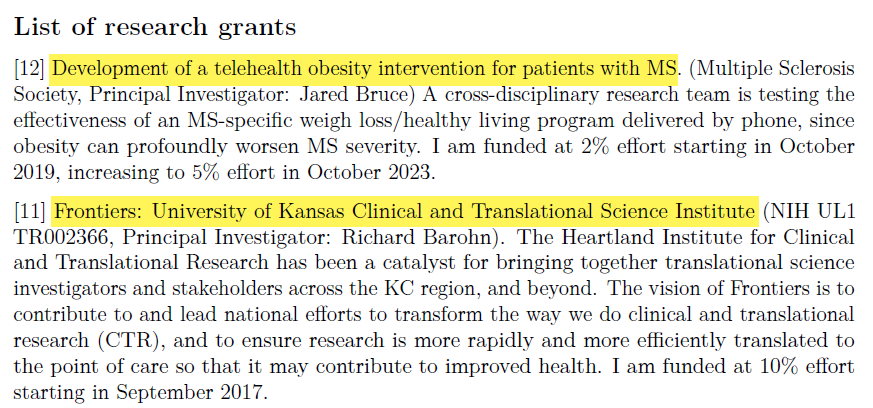
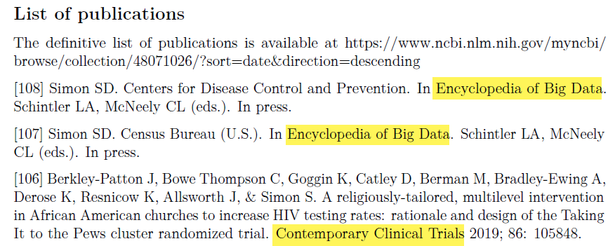
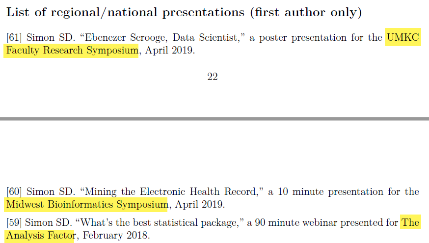

## Outline of this talk

-   Brief introduction
-   Embrace continuing education
-   No one likes a wishy-washy statistician
-   Since you asked about AI
-   Find this talk at
    -   https://github.com/pmean/talks/blob/master/consulting-careers/2026-panel.md
  
## My resume will introduce myself.

::: {.notes}

I'm going to cut and paste portions of my resume into PowerPoint as a way to introduce myself.

:::

## I got my degree almost 40 years ago

::: {.notes}

If the saying about teaching an old dog new tricks is accurate, then I am in trouble. I got my PhD in Statistics from the University of Iowa in 1982. Much of what I've learned in college and throughout my long career is obsolete.

:::

## I juggle two jobs.

::: {.notes}

I work at two jobs. I am a faculty member in the Department of Biomedical and Health Informatics at the University of Missouri-Kansas City, and I also run an independent consulting business. I will focus my talk on the latter job, because that is the one that most people are interested in hearing about.

:::

## I used to work at a hospital, ...

::: {.notes}

Most of my previous work was consulting in health care areas. I worked with a lot of Pediatricians at Children's Mercy Hospital in Kanas City.

:::

## for Uncle Sam, ...

::: {.notes}

I also did a lot of work in occupational safety and health.

:::

## at a different University, ...

::: {.notes}

Plus I have taught Business Statistics for undergraduate and MBA students.

:::

## and as student director of a consulting center.

::: {.notes}

During my training at the University of Iowa, I got a lot of applied experience

:::

## I've been on a few research grants, ...

::: {.notes}

I've been on a few grants and have helped out on many others that were too small to include funding for a statistician.

:::

## written a few papers, ...

::: {.notes}

I've written quite a few papers, though only a handful as first author.

:::

## and given a few talks.

::: {.notes}

I love giving talks like this one. If anyone needs a speaker, I am glad to jump in and help.

:::

## Embrace continuing education

-   Evidence-Based Medicine
-   Markov Chain Monte Carlo
-   Meta-analysis
-   Mixed models
-   Model based clustering
-   Reproducible research
-   Smoothing splines

::: {.notes}

There are a lot of areas that just didn't exist when I went to school. I spend a lot of time on continuing education.

In twenty years, you will have a similar list. It won't be these things, it will be things that none of us know about today.

Now it does bother me a bit to go to a short course where the instructors are half my age and twice as smart. But just wait a few years. Then the instructors will be one-third my age and three times as smart.

:::

## No one likes a wishy-washy statistician.

-   Be decisive
    -   Use the word "best"
    -   If you're going to make a mistake, make a loud mistake
    -   Clients can articulate better after seeing a bad proposal
-   But don't be arrogant
    -   Admit when your opinion is a minority perspective
    -   Be honest about what you know and what you don't know
    -   Listen to and respect alternative opinions

::: {.notes}

Be firm in your recommendations. Don't sugar coat things, but when you choose an approach tell your clients that this is the optimal approach. It will have weaknesses, for sure, but all the alternatives are worse. So use the word "best" in your descriptions.

Now nobody is perfect, and sometimes what you recommend may not be the best approach. So I fall back on what I learned about playing piano when I was dating a piano major in college. She said, when you make a mistake make a loud mistake. Play boldly. If you are afraid of making a mistake, you will still make mistakes, but you style will be weak and tentative. 

Be the same with your consulting. Consult boldly. It you are timid, the few times when your recommendation falls flat are counterbalanced by the more numerous times that your good recommendations come across as weak and tentative.

The other thing to note is that your clients will often have a difficult time articulating exactly what they want. But if they see something that isn't what they want, they can do a better job explaining why what you gave them is not right and what they really want.

Being decisive, though, does not mean being arrogant. Be honest about what you know and what you don't know. Say that you've never done a meta-analysis before, so you need to work cautiously and review the literature carefully.

Also, listen to and respect alternative opinions. The people you work with have an advantage over you in that they know the commonly used standards in their discipline. So if they say they want something and it isn't what you feel is the best option, ask if it is defensible. Can it pass peer review. You do want to avoid giving in when the approach they choose does violence to the data. But only then. Most of the time, respect their approach.

I've heard quotes like statisticians are the guardians of objectivity and the gatekeepers of the scientific method. Fine, maybe, but don't act like everyone else is subjective or that they don't know how to apply the scientific method.

:::

## Since you asked about AI

-   Overhyped
    -   AI is not our salvation
    -   AI is not our doom
-   Example: AI hack of Huggingface
    -   Headline: Extremely intelligent AI prototype breaks out of sandbox
    -   Should have been: Extremely stupid programmers build a flimsy sandbox
-   There is a huge monetary incentive to oversell benefits and risks

::: {.notes}
I hate talking about AI. By AI I mean all the large language models and generative AI systems that are coming on the scene. Everyone else is talking about AI. I was getting a haircut and my hairdresser started talking about AI. 

So I feel compelled to join the crowd.  AI is okay but just okay. There are some niche applications where AI works well and those niches will grow over time. But AI is not our salvation. 

Elon Musk gives us an example of how utopian some views of AI are. Elon Musk confidently predicted that in 10 to 20 years, AI and robotics will make work optional. This is a totally idiotic prediction. We are not going to have a sustainable colony on Mars in 10 to 20 years and we will still have to work in 10 to 20 years. Not me...I'll be in the Alzheimers memory unit in 10 to 20 years, but don't you youngsters worry. Your work will be as different from today's work as today's work was from the punched cards that I used in college. But for good and for bad, work will still be there for you.

The flip side of the coin is all the doom sayers that say AI will destroy us. We do have to worry about autonomous military drones that end up killing innocent people, but it really won't be as bad as all the undiscovered land mines that already are killing innocent people.

Will we have a future like Agent Smith in the movie, The Matrix? Or like T-800 in the movie, The Terminator? No. We'll have a future like HAL in the movie, 2001: A Space Odyssey. If we find a misbehaving AI system, we just pull the plug and listen as it fades away singing "Daisy, Daisy, give me your answer true."

Everyone is really scared of the AI system that hacked Huggingface. The terrifying headlines read something like "Extremely intelligent AI prototype breaks out of sandbox". I'm sorry, but that is the wrong headline. It gives to much credit to the prototype and needs to address the real problem. The real problem is the extremely stupid human programmers who built a sandbox so flimsy that even an overrated and overhyped AI prototype could force its way outside.

I do think AI is good and getting better, but keep in mind that all the hypesters and all the doom sayers have a strong financial incentive to oversell the benefits and risks of AI.

So why cry doom and gloom if you are promoting AI? It is like the PR firm that takes on Kim Jung Un as a client. You think to yourself: a PR firm that can handle a client that toxic is sure to do a great job for someone slightly less toxic like me. Similarly, you think to yourself: an AI model that can figure out how to take over the world can surely figure out what jobs at my company it can take over.
:::

## Summary

-   Brief introduction
-   Embrace continuing education
-   No one likes a wishy-washy statistician.
-   Since you asked about AI
-   Find this talk at
    -   https://github.com/pmean/talks/blob/master/consulting-careers/2026-panel.md