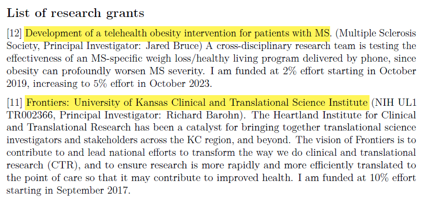

### My resume will introduce myself.

I'm going to cut and paste portions of my resume into PowerPoint as a way to introduce myself.

### I got my degree almost 40 years ago

If the saying about teaching an old dog new tricks is accurate, then I am in trouble. I got my PhD in Statistics from the University of Iowa in 1982. Much of what I've learned in college and throughout my long career is obsolete.

### I juggle two part time jobs.

I work at two jobs. I am a part-time faculty member in the Department of Biomedical and Health Informatics at the University of Missouri-Kansas City, and I also run an independent consulting business. I will focus my tlk on the latter job, because that is the one that most people are interested in hearing about.

### I used to work at a hospital, ...

Most of my previous work was consulting in health care areas. I worked with a lot of Pediatricians at Children's Mercy Hospital in Kanas City.

### for Uncle Sam, ...

I also did a lot of work in occupational safety and health.

### at a different University, ...

Plus I have taught Business Statistics for undergraduate and MBA students.

### and as student director of a consulting center.

During my training at the University of Iowa, I got a lot of applied experience

### I've been on a few reserach grants, ...

I've been on a few grants and have helped out on many others that were too small to include funding for a statistician.

### written a few papers, ...

I've written quite a few papers, though only a handful as first author.

### and given a few talks.

I love giving talks like this one and once the Pandemic has ended, I would love getting up to Omaha or Lincoln to talk more about my research interests.

### I'm not actively looking for a job, but ...

+ These PowerPoint slides available at [https://github.com/pmean/papers-and-presentations](https://github.com/pmean/papers-and-presentations).
+ My resume available at [https://github.com/pmean/resume](https://github.com/pmean/resume).

I'm pretty happy where I am, but certainly would not mind hearing about other opportunities if there is a good fit. But I promised that if one of you applies for the same job, I will put in a good word on your behalf.

###	What were the courses you have taken that have been the most beneficial for your job?

+ Applied courses outside Department of Statistics
  + Biostatistics, Education
  + Very practical advice
  + Specialized perspectives ()
+ Theory of Mathematical Statistics
  + KNowing foundations increases your confidence level
  + Also makes you a quick learner of new methods

I have to cite two extremes. The first set of classes that I got the most out of were the very applied Statistics classes that I took from outside the Department of Statistics at Iowa. There were two classes in Biostatistics: Categorical Data Analysis and Survival Analysis, and one in Education, Scaling methods. These helped me see better how the broadly based classes in my own department could be applied to solve real world problems.

The other class was quite theoretical, and it helped me understand some of the foundations. Knowing the foundations gives you a higher level of confidence in what you do. You know both the how and why of what you do. It also makes you a fast learner. When you can "peek under the hood" and know how a new methodology works, you can pick up that new methodology so much faster.

### Which aspects of your work did you learn on the job?

+ Evidence-Based Medicine
+ Gibbs sampling
+ How to supervise
+ Meta-analysis
+ Mixed models
+ Model based clustering
+ Modern statistical software
+ Smoothing splines

There are a lot of areas that just didn't exist when I went to school. I spend a lot of time on continuing education.

### What, if anything, do you wish you knew before entering the workforce or taking your current position?

+ Interpersonal consulting skills
+ Start early on publications

### How much should an entry level statistician expect to make in your field? After 5 years of experience?

+ Outside my area of expertise (sorry!)
  + See various salary surveys

###	What do you recommend as the best places to look for new job opportunities?

+ Outside my area of expertise (sorry!)

### How do you find your clients/collaborators?

+ Word of mouth
  + Let everyone know you are looking
+ Increase your visibility
  + Blogs
  + Social media
  + Presentations
  + Volunteer

###	What advice do you have to give regarding balancing competing priorities?

+ Life is short. Do the fun stuff first.
+ Ask your boss for priorities

It can get you in trouble sometimes, but do spend time doing what you consider fun. The uninteresting stuff will need to get done eventually, but you can't be a slave to this. Life gets boring if you can't work on what you love.

Of course, your boss should have a strong say in what your priorities are, if you have a boss.

###	What do you do when you have a project that is outside your level of expertise (who or what resources do you consult)?

+ Nothing is ever outside my area of expertise!
  + Just kidding
  + But I do try to know a bit about everything
+ Opportunity to learn on the job
  + Books, short courses, Internet resources
  + Build a network of helpers

it helps a lot in consulting to be able to field questions from any direction. So I try very hard to know a little bit about everything. While I will sometimes say "I'm not qualified to do this work," I do try very hard to  build my knowledge base to the point where I can help out with any reasonable request. I do warn people when I am not an "expert" in a particular area, though, and am not offended if they find someone who knows more about an issue than I do. But often these people do not have the time or energy or knowledge to find someone better than me, and I would feel bad if they didn't get any help.

###	What is an issue you have faced working with a client or collaborator, and what did you learn from it?

+ Get and give regular feedback

You can't go off by yourself for weeks or months and hope that when you emerge, you will have the perfect data analysis. There is a lot of back-and-forth that needs to happen continually.

### What are some ethical dilemmas you have faced in your job? 

+ Asking for the impossible
  + "Blood from a turnip" test

