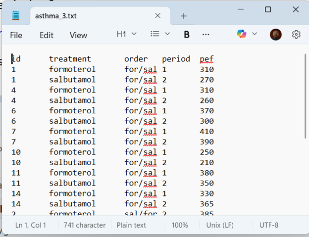

```{r}
#| label: 03-setup
#| message: false
#| warning: false

library(broom)
library(gt)
library(tidyverse)
```

## Accounting for period effects

-   Improves precision
-   Adjusts for imbalances
-   Requires layout used for completely randomized block design

::: notes
Speaker notes

Using a paired t-test to analyze the AB/BA cross-over design is a good approach. It may or may not pass muster with whoever is reviewing your work.

You may, however, elect to adjust your model for period effects. There are several reasons for this.

First, removing variation associated with the period effect will improve power and precision.

If there are imbalances in period (one treatment getting first period more often and the other getting second period more often), then adjusting for period will remove a potential source of bias.

Adjusting for period requires you to use the long format, where all the outcomes are stored in a single column. T he layout, which you will see in a minute, is a bit tricky.
:::

## Why might you see period effects

-   Temporal trends
    -   Learning/fatigue effect
    -   Degenerative diseases, acute conditions
    -   Seasonal effects
-   Carry-over: Persistence of a treatment applied in one period in a subsequent period of treatment
    -   Physical persistence
    -   Curative effect
    
    
::: notes
Speaker notes

Period effects are an acknowledgement of the Heraclitus quote "No man can step into the same river twice."

There are several possible explanations for a period effect. There may be a time trend. There are many possible causes for a trend over time. 

There may be a learning effect. A patient may develop better self-care habits over time. They may comply more closely with the treatment requirements over time. Practice makes perfect. In an extreme case, the outcome in the second period could always be better than the outcome in the first period, no matter what the treatment. This harkens back to the Yoda quote "You must unlearn what you have learned".

There may be a fatigue effect. Patients may start out with an enthusiasm that has them complying with all the treatment requirements. That enthusiasm, though, could fade over time. So the outcome in the second period could be worse that the outcome in the first period, no matter what.

Some diseases are degenerative (Alzheimer's is an example). They inevitably get worse over time, and even the best treatments are only good at slowing the progression.

Some diseases are acute (or short-term). There's a joke going around about the common cold. If you treat it aggressively, it will be gone in only seven days. If you don't it will last an entire week. It doesn't have to be this extreme, but any medical condition where the condition tends to ease up over time could produce a temporal effect.

As you can see, context is all important. Temporal effects could cause a change in either direction, depending on the medical condition and the treatments being used.

There may be seasonal effects. If all of the first period treatments are in the dead of winter and the second period treatments are in the early spring, maybe the outcome changes from winter to spring. It could be that outcomes are worse in the cold dry winters, or maybe they are worse in the pollen laden spring.

Researchers need to worry more about temporal effects and not just in cross-over trials.

The one thing that everyone worries about is the carry-over effect. Let's define this carefully to distinguish from any of the temporal effects discussed earlier.

A carry-over effect is a persistence of a treatment across time.

It could be caused by a residual amount of the first drug remaining in your body at the time that the second drug is administered. You can also have a residual effect for non-drug treatments. If the first intervention involves an exercise program, your patients might enjoy those 30 minute walks in the exercise intervention so much that they keep doing it when the second, non-exercise intervention begins. Maybe less frequently, but still it's a good habit that is hard to break away from completely.

It could also be a residual curative effect of the first treatment that adds to the impact on the outcome when the second treatment is started. The benefits of an intervention can sometimes disappear all at once the intervention is over, but sometimes the benefits just fade slowly over time.

A big problem is that you often cannot tell, just by looking at the data, whether a period effect is temporal or due to a carry-over. You need to evaluate this qualitatively by looking at what you know about things like the mechanism of action for each treatment.
:::

## Layout for asthma data



::: notes
Speaker notes

The layout puts all of the outcome data in a single column. It also has to track which patient (the id variable), which drug (the treatment variable), which sequence (the order variable), and whether the treatment in question was administered first or second (the period variable).

Notice that there is a redundancy here. If you know which treatment and which order, you can figure out what the period is. That's okay. You still need all of these variables to fit the model properly.
:::

## Counts for layout data

```{r}
asthma_3 |>
  count(treatment, order, period) |>
  gt()
```

::: notes
Speaker notes

Just a reminder that there is a slight imbalance in treatment order, seven for/sal and only six sal/for.

Notice also that the three binary categories (treatment, order, and period) would normally produce eight combinations if you crossed all of them together. But certain combinations are not possible, such as treatment=formoterol, order=for/sal, and period=2. This means that you can't estimate certain interactions. In particular, the treatment by period interaction is confounded with the main effect of order.
:::

## Period by order means

```{r}
#| label: 02-means-1

asthma_1 |>
  group_by(order) |>
  summarize(
    period1_mean=mean(period1),
    period2_mean=mean(period2)) -> means_1
means_1 |> 
  gt() |>
  fmt_number(decimals=0)
```

::: notes
Speaker notes

Here are the means for each period stratified by order. Notice that the period1 mean is highest for the for/sal order and the period2 mean is highest for the sal/for order. 
:::

## Period by order plot

```{r}
sz <- 5

means_1 |>
  pivot_longer(
    starts_with("period"),
    names_to="period",
    values_to="mean_pef") |>
  ggplot() +
  aes(x=period, y=mean_pef, group=order) +
  geom_line() +
  geom_text(x=2.01, y=345.8, label="f", size=sz) +
  geom_text(x=0.99, y=283.3, label="s", size=sz) +
  geom_text(x=0.99, y=337.1, label="f", size=sz) +
  geom_text(x=2.01, y=306.4, label="s", size=sz) +
  labs(caption="Larger values are better")

```

::: notes
Speaker notes

This is a plot of the four means. The line sloping upward shows the results when salbutamol is given first. A positive slope shows that the patient improves when switching from salbutamol to formoterol.

The line sloping downward shows the results when formoterol is given first. A negative slope shows that the patient does worse when switching from formoterol to salbutamol.

Notice also that the period1 formoterol value (the f in the upper left) is not quite as good as the period2 formoterol value (the f in the upper right). Similarly, the period1 salbutamol value (the s in the lower left) is not quite as good as the period2 salbutamol value (the s in the lower right). 

Two conclusions are obvious from this graph. First, you always are better off with formoterol. Second, no matter which drug you take, you see better results in period2 than in period1.
:::

## What this graph would look like without a period effect

```{r}
#| label: no-period-1

data.frame(
  period = glue("period{c(1,1,2,2)}_mean"),
  order = rep(c("for/sal", "sal/for"), 2),
  mean_pef = c(300, 340, 340, 300)) |>
  ggplot() +
  aes(x=period, y=mean_pef, group=order) +
  geom_line() +
  geom_text(x=2.01, y=340, label="f", size=sz) +
  geom_text(x=0.99, y=300, label="s", size=sz) +
  geom_text(x=0.99, y=340, label="f", size=sz) +
  geom_text(x=2.01, y=300, label="s", size=sz) +
  scale_y_continuous(breaks=10*(30:34), labels=rep(" ", 5)) +
  labs(caption="Larger values are better")
```

::: notes
Speaker notes

If there were no period effect then the positive slope for the for/sal order would match the negative slope for the sal/for order. The mean effect for either drug would be the same in period1 and period2.
:::

## Treatment by order means

```{r}
#| label: 02-means-2

asthma_2 |>
  group_by(order) |>
  summarize(
    formoterol_mean=mean(formoterol),
    salbutamol_mean=mean(salbutamol)) -> means_2
means_2 |>
  gt() |>
  fmt_number(decimals=0)
```

::: notes
Speaker notes

If you use the second layout, where the first column is the formoterol outcomes and the second column is the salbutamol outcomes, the summary statistics are not quite the same, but they do tell a similar story. The formoterol means are better (higher) than the salbutamol means. The formoterol mean in the for/sal order is not quite as good as the formoterol mean in the sal/for order. The salbutamol mean in the for/sal order is better than the salbutamol mean in the sal/for order. So testing in the second period is slightly better than testing in the first period, no matter which drug.
:::

## Treatment by order plot

```{r}
#| label: 03-order-plot

means_2 |>
  pivot_longer(
    ends_with("mean"),
    names_to="treatment",
    values_to="mean_pef") |>
  ggplot() +
  aes(x=order, y=mean_pef, group=treatment) +
  geom_line() +
  geom_text(x=2.01, y=345.8, label="f", size=sz) +
  geom_text(x=2.01, y=283.3, label="s", size=sz) +
  geom_text(x=0.99, y=337.1, label="f", size=sz) +
  geom_text(x=0.99, y=306.4, label="s", size=sz) +
  labs(caption="Larger values are better")
```

::: notes
Speaker notes

I like this graph better than the earlier one. You see a clear gap between formoterol and salbutamol. The gap is a bit wider for the sal/for order. This makes sense. In the sal/for order, salbutamol is at its worst because it is period1. Formoterol is at its best because it is period2.
:::

## What this graph would look like without a period effect

```{r}
#| label: no-period-2

data.frame(
  treatment = rep(c('formoterol', 'salbutamol'), each=2),
  order = rep(c("for/sal", "sal/for"), 2),
  mean_pef = c(340, 340, 300, 300)) |>
  ggplot() +
  aes(x=order, y=mean_pef, group=treatment) +
  geom_line() +
  geom_text(x=2.01, y=340, label="f", size=sz) +
  geom_text(x=0.99, y=300, label="s", size=sz) +
  geom_text(x=0.99, y=340, label="f", size=sz) +
  geom_text(x=2.01, y=300, label="s", size=sz) +
  scale_y_continuous(
    limits=c(280, 360),
    breaks=10*(30:34), 
    labels=rep(" ", 5))
```

::: notes
Speaker notes

If there were no effect due to period, both lines would be flat.
:::

## Accounting for period effects

```{r}
#| label: 03-period

m6 <- lm(pef ~ order + id + period + treatment, data=asthma_3)
anova(m6)
```

::: notes
Speaker notes

The model that properly accounts for period effects has to include a factor for order, id, period, and treatment.
:::

## Details on the period model

-   id is nested within order
-   id is a random effect
    -   Test of order should be MS(order)/MS(id)
-   Use partial (Type III) sums of squares if unbalanced

::: notes
Speaker notes

A few details on this model are needed. First, id is a nested within order. The way that id was coded in this dataset, you did not have to worry about it. If ids were code 1 through 7 in the patients in the for/sal arm and coded 1 through 6 in the sal/for arm, then you have to designate id as a nested factor.

The id factor is also a random effect. That means that the test of order should use MS(order) divided by MS(id). The test of order is a between subjects comparison.

Finally, this data is unbalanced. There are 7 subjects in the for/sal arm and 6 in the sal/for arm. With unbalanced data, even a very minor imbalance, you should use partial or type 3 sums of squares. I deliberately put treatment as the last term in the model to insure that the effect of treatment is adjusted for every other factor.
:::
