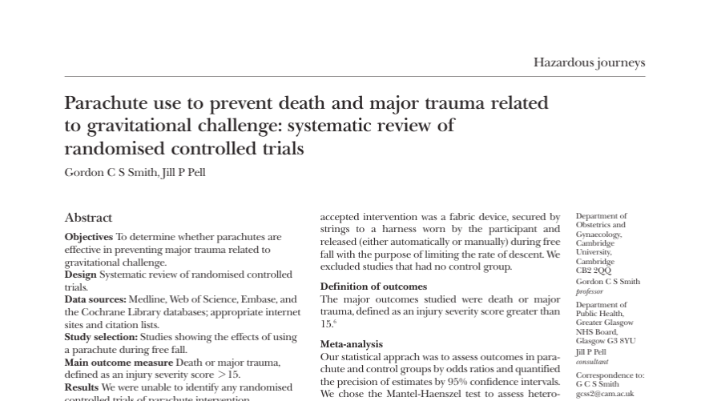

```{r}
#| label: 04-setup
#| message: false
#| warning: false

library(broom)
library(tidyverse)
```

## Systematic overview of parachute use



::: notes
Speaker notes

From the abstract: "As with many interventions intended to prevent ill health, the effectiveness of parachutes has not been subjected to rigorous evaluation by using randomised controlled trials. Advocates of evidence based medicine have criticised the adoption of interventions evaluated by using only observational data. We think that everyone might benefit if the most radical protagonists of evidence based medicine organised and participated in a double blind, randomised, placebo controlled, crossover trial of the parachute."
:::

## When you cannot use a cross-over trial

-   Acute conditions
-   Mortality and other irreversible events
-   Training/education
-   Irreversible treatments
-   Persistent effects

::: notes
Speaker notes

These may be obvious, but it is worth stating them anyway. You can't do a cross-over trial for an acute condition because everything will be over before you can rerun the second treatment.

You can't do a cross-over trial for mortality because of the acronym YOLO. So don't try to do a cross-over trial where you measure the outcome of using or not using a parachute on death. Well, of course, but the same applies for many other measures that are irreversible. Suppose the outcome you are trying to prevent is amputation of a limb. If that unfortunate event occurs during the first treatment, you can't cross-over to the other treatment.

You can't use a cross-over trial with a treatment that involves training or education. You would almost certainly have a carry-over effect unless you could figure out some way to "unlearn what you have learned."

If one or both of the treatments are irreversible, you can't run a cross-over trial. Surgery, for example, is irreversible. There are a series of surgeries that all end in "ectomy". There's appendectomy, hysterectomy, spleenectomy, and my least favorite, orchiectomy. If one treatment arm is an orchiectomy, you can't cross-over to a time when you try to patch things back up.

Finally, if the outcome being sought is persistent, you are out of luck. If you want to test two treatments for acne, if the first one works well, there won't be any acne for the second treatment to work on.
:::

## When you can use a cross-over trial

-   Chronic conditions
-   Short-term benefits
-   Adequate wash-out period
    -   Drugs with a short half-life

::: notes
Speaker notes

Looking at all the things that you can't use a cross-over trial for makes it much clear when you can use a cross-over trial. It has to be for a chronic condition and it has to measure benefits that are short-term and reversible.

When you are testing drugs, you need to make sure you have an adequate wash-out period. This means that you can only study drugs that have a short half life. The recommendation for most cross-over trials is that the wash-out period be equal to five half lives. Note that 1/2 raisded to the 5th power is 1/32 or 0.03126. Also the washout period should be significantly longer than the amount of time under evaluation for either arm. Don't treat someone for a full month and then only have a two day washout period before starting a month on the other treatment.
:::

## Practical and ethical concerns

-   Can you ask a patient to endure two treatments?
-   Do you have enough time to run two treatments in succession?
-   Can you leave the patient untreated during the wash-out period?

::: notes
Speaker notes

There are limits to what we can ask patients to endure. I've had a few colonoscopies. They are no fun, but I endure them, once every three years. But I'm not going to sign up for a cross-over trial of two different  colonoscopy devices. If they ask me to return in a week to test the second piece of equipment, that's where I draw the line.

A cross-over trial takes twice as long as a parallel groups trial...more than twice as long if you have a wash-out period.

Speaking of wash-out periods, is it okay to ask your patients to forgo any therapy for a few days or a few weeks? There was a cross-over trial for comparing two drugs that treat depression. I don't have the details, but if I recall things correctly, there was a wash-out period and several patients committed suicide during the wash-out period.
:::

## What is you have a carry-over effect?

-   No easy answer
    -   Adjustments have poor power
    -   Between subject comparison
-   Unclear where to make adjustments
    -   Active treatment versus placebo: 
        -   Assign the carry-over to placebo
    -   Two active treatments: 
        -   Split the difference
    -   Carry-over could a temporal trend instead
        
::: notes
Speaker notes

Carry-over effects are a big problem. If they occur, it is almost impossible to resolve things. 

You would like to just adjust for carry-over effects, but the estimate of carry-over is a between subjects comparison that has very little precision or power.

Also complicating things is that carry-over effects can manifest themselves in several different ways. If you are comparing an active drug to a placebo, there is no carry-over effect when you switch from the placebo to the active drug because the residual amount of placebo in your system is not going to have an impact on the active drug. But a residual amount of active drug can most certainly impact the evaluation of the placebo. So if you can estimate the carry-over effect, use it to adjust the measurement in the placebo arm only.

If you are comparing two active drugs, it may make sense to adjust both drugs because there will be a residual effect in either direction. But what if one of the drugs has a much shorter half life than the other?

What you estimate as a carry-over effect may actually be a temporal trend instead. Adjusting for temporal trends might not be the same as adjusting for carry-over.
:::

## Change test if carry-over is detected

-   Test hypothesis of no carry-over
    -   If accept null, run the cross-over
    -   If reject null, look at first period only
-   Not recommended
    -   Limited power to test carry-over
    -   First period analysis loses too much power/precision

::: notes
Speaker notes

One recommendation for carry-over is to run a conditional test. Screen for carry-over. If you accept the null hypothesis and conclude that there is no carry-over, go ahead with the cross-over trial that you have planned. If you find there is a carry-over, just discard the second period data. Using just the first period data converts your cross-over trial into a parallel groups trial.

This approach is not recommended. First, the test for carry-over is going to be a between subjects comparison which has very little power. Making things worse, if you do switch to analyzing just the first treatment received, you lose too much power and precision. You might as well just abandon the whole study.
:::

## The solution to carry-over

-   Design the study to avoid any carry-over
    -   Requires in depth understanding of the treatments
    
::: notes
Speaker notes

Carry-over prevents an insolvable problem. You can't adjust for it and you can't modify your test if you detect carry-over. This is not my opinion. It is the opinion of Stephen Senn and other experts in the area.

The only thing you can do is to design the study so that you are reasonable confident that there will be no carry-over effect. This is not easy. You need to understand every detail of the two treatments you are examining. What is their mechanism of action? How long do the treatments impact your outcome measure?

If the treatments are drugs, how quickly are the drugs absorbed? How soon do the drugs reach a steady state? How rapidly does the drug disappear from the body once treatment ends?

Also think about the disease you are treating. What is the natural course of the disease? Is it steadily degenerative? Does it resolve quickly over time?

Put this all together and make a case, largely based on qualitative arguments, that the way you designed this study provides reasonable insurance that there is no carry-over effect.
:::
