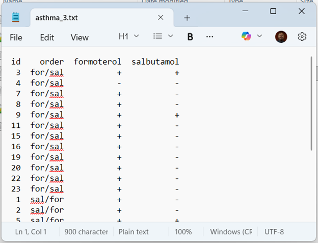

```{r}
#| label: 05-setup
#| message: false
#| warning: false

library(broom)
library(tidyverse)
```

## Binary outcomes in a cross-over trial

-   Continuous outcomes almost always better
-   Binary outcomes require changes in the statistical model
-   Adjusting for period effects is tricky

::: notes
Speaker notes

You can do analyze binary outcomes in a cross-over trial, but always ask yourself why. Continuous outcomes are almost always preferred. Binary outcomes do not have shades of gray and this greatly limits power and precision.

If you have to use a binary outcome, your statistical model changes and it becomes harder to adjust for period effects.
:::

## Example of a binary outcome



::: notes
Speaker notes

This data is from page 104 of Stephen Senn's book on cross-over trials. The two drugs being tested are our old friends formoterol and salbutamol. The outcomes are classified as either good (a plus sign) or bad (a minus sign).
:::

## Descriptive statistics

```{r}

mcnemar <- matrix(c(
  "  ", "F-", "F+",
  "S-", " 2", "15",
  "S+", " 1", " 6"), 
  nrow=3, byrow=TRUE) |>
  data.frame() 
mcnemar |> gt() |> tab_options(column_labels.hidden = TRUE)
```

```{r}
#| label: mcnemar
#| eval: false

asthma_4 <- matrix(c(2, 15, 1, 6), nrow=2)
mcnemar.test(asthma_4, correct=FALSE)
```

## Analysis of binary cross-over data

-   Ignoring period effects
    -   McNemar's test
-   Incorporating period effects
    -   Mainland-Gart test (hard to find)
    
## Example of McNemar's test

Table layout:

```{}
a b
c d
```

-   Ignore a and d
-   Compute $T=\frac{(b-c)^2}{b+c}$
-   Compare to $\chi^2(1)$

## McNemar's test on formoterol/salbutamol data

-   b=15, c=1
-   $T=\frac{(15-1)^2}{15+1}$=12.25
-   $\chi^2(0.95, 1)=$3.84
-   Reject H0. Formoterol is superior.

::: notes
Speaker notes

In the formoterol/salbutamol study, you ignore the two patients who improved with both drugs and the 6 patients who got worse with both drugs. Focus all your intention on the 15 patients who got better only with formoterol adn the 1 patient who only got better on salbutamol. If you calculate the test statistic, you get 12.25 which is much larger than 3.84, the critical value from a chi-squared distribution with one degree of freedom. You conclude that there is a statistically significant difference in favor of formoterol.

I did not find an easy way to compute the Mainland-Gart test that accounts for period effects.
:::
