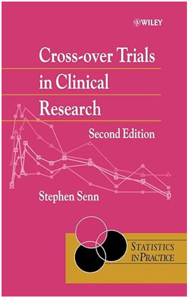
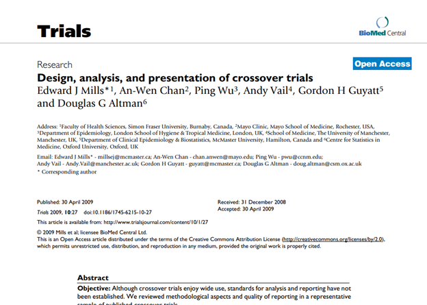

```{r}
#| label: setup
#| message: false
#| warning: false

library(glue)
library(readr)
library(rms)
library(tidyverse)

# Keep this chunk, even if no code, so that
# params is populated from the yaml header.

# Be sure to include the proper template
#
# format:
#   pptx:
#     reference-doc: T#015 STSP-PPT-Wide-Template.pptx

# Don't forget to try slide-number: true

# Important objects created by this file
#
#   asthma_1: AB/BA crossover with period variables
#   asthma_2: AB/BA crossover with treatment variables
#   asthma_3: AB/BA crossover in long format
#   couples: paired data in wide format
#   couples_1: paired data in long format
#
# _cross-over-01
#   m1: paired t-test for couples data
#   m2: crbd for paired data
#
# _cross-over-02
#   m3: paired t-test for AB/BA crossover
#   m4: crbd for AB/BA crossover
#
# _cross-over-03
#   m6: period effects for AB/BA crossover


```

## Topics to be covered

-   What you will learn
    -   `r params$topic_01`
    -   `r params$topic_02`
    -   `r params$topic_03`
    -   `r params$topic_04`
    -   `r params$topic_05`
    -   `r params$topic_06`
    
::: notes
Speaker notes

Cross-over trials provide a very powerful approach for comparing two treatment conditions. Research subjects get both treatment conditions, which we will label arbitrarily as A and B. A randomly selected half get A followed by B and the other half gets B followed by A. This is generally referred to as the AB/BA design. Because each subject serves as their own control, you remove a large amount of variation. Often a cross-over trial can produce good results, even with a few dozen patients.

Cross-over trials require that the condition being studied is chronic in nature, and that the effect of the first treatment given does not carry over into the second treatment evaluation. There are important ethical and practical concerns about designing cross-over trials.

In this talk, you will see a review of the paired t-test, followed by an analysis of the AB/BA crossover design as a paired t-test. Then you will see how to account for the order in which the treatments were given. 

After discussing the classical AB/BA cross-over design, you will see how to extend the cross-over trial to a binary outcome measure and to more than two treatments.

:::

## Pop quiz, true or false

1. Cross-over trials can only be used if the two treatments are drugs.

2. A paired t-test is a simple way to analyze a basic cross-over design.

3. A carry-over effect is easily accounted for and adjustments are relatively simple.

4. Cross-over trials should only be used if the disease being treated is acute, meaning that it does not persist over long periods of time.

Put your answers in the chat box as a sequence of T's and F's (e.g., TFFT).

::: notes
Speaker notes

Try these true/false questions. Put your answers in the chat box.
:::



## Break #1

-   What you have learned
    -   `r params$topic_01`
-   What's coming next
    -   `r params$topic_02`



## Break #2

-   What you have learned
    -   `r params$topic_02`
-   What's coming next
    -   `r params$topic_03`
    


## Break #3

-   What you have learned
    -   `r params$topic_03`
-   What's coming next
    -   `r params$topic_04`
    


## Break #4

-   What you have learned
    -   `r params$topic_04`
-   What's coming next
    -   `r params$topic_05`



## Break #5

-   What you have learned
    -   `r params$topic_05`
-   What's coming next
    -   `r params$topic_06`
    


```{r}
#| label: save-everything

save.image("../data/cross-over.RData")
```

## The definitive guide



## Nice reference



::: notes
Speaker notes

Mills, E.J., Chan, AW., Wu, P. et al. Design, analysis, and presentation of crossover trials. Trials 10, 27 (2009). DOI: [10.1186/1745-6215-10-27][ref-mills-2009] 

[ref-mills-2009]: https://doi.org/10.1186/1745-6215-10-27
:::

## Analysis Factor resources

-   Kim Love webinar on classical experimental designs
-   Karen Grace-Martin write-ups on long versus wide formats

::: notes
Speaker notes

There are several resources on the Analysis Factor website that you might find helpful.
:::

## Repeat of true/false pop quiz

1. Cross-over trials can only be used if the two treatments are drugs.

2. A paired t-test is a simple way to analyze a basic cross-over design.

3. A carry-over effect is easily accounted for and adjustments are relatively simple.

4. Cross-over trials should only be used if the disease being treated is acute, meaning that it does not persist over long periods of time.

Put your answers in the chat box as a sequence of T's and F's (e.g., TFFT).

::: notes
Speaker notes

Try these true/false questions again. Put your answers in the chat box.
:::


## Summary

-   What you have learned
    -   `r params$topic_01`
    -   `r params$topic_02`
    -   `r params$topic_03`
    -   `r params$topic_04`
    -   `r params$topic_05`
    -   `r params$topic_06`

::: notes
Speaker notes

Here is an overview of the topics you've just seen.
:::

<!---
      You have to put the title down 
      here to override the titles of
      all the include files.
--->

---
title: "Cross-over trials"
author: "Steve Simon"
---