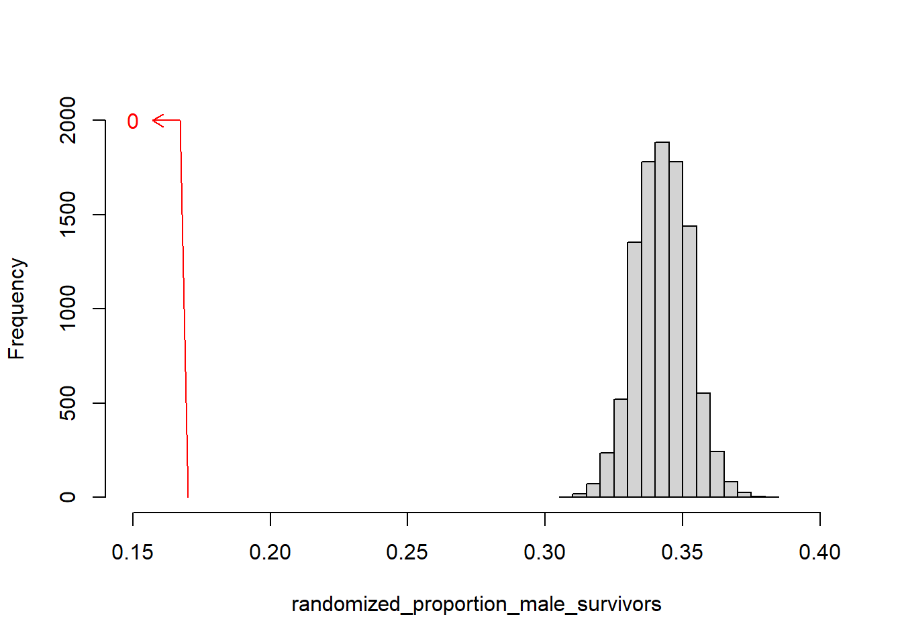

```{r setup, echo=FALSE}
knitr::opts_chunk$set(
  fig.width=6,
  fig.height=3,
  echo=FALSE,
  message=FALSE,
  warning=FALSE)
suppressMessages(
  suppressWarnings(
    library(tidyverse)
  )
)
```

### Where this fits


<div class="notes">

Most of you should be familiar with the components and stages that The Analysis Factor uses to classify their talks. This talk is in Stage 3, Extensions of Linear Models. It covers a pretty broad swath, but might be considered as interpreting results. Perhaps validating results might be a second component.

</div>

### Goal

For you to have a good understanding of:

+ what randomization and exact tests are,
+ when it is appropriate to use them,
+ the steps to implement them.

The goal is not to cover every possible application of the randomization and exact tests.

<div class="notes">

I want to start with an appreciation of when you might consider using exact or randomization tests. These tests are very general, and I will try to show a variety of applications. If you want to implement these tests yourself, it is not too difficult for simpler hypotheses. For more complex hypotheses, you need some basic programming skills. It is not too difficult, if you know how to use loops inside SAS, R, or Stata.

It's not possible to cover every possible application of exact and randomization tests today. I hope just to get you a bit more comfortable with the methodology in general.

</div>


### Outline of topics

+ Historical origins of Fisher's Exact Test
+ Other exact tests
+ Randomization tests
+ Programming requirements
+ When should you use these tests

<div class="notes">

Here is an outline of the topics you will see today.

First, I will provide a historical overview, with an example derived in 1931, when Statistics was still in its infancy.

</div>

### Historical origins of Fisher's Exact Test


<div class="notes">

Let's start with a historical overview. Ronald Fisher was a pioneer in the field of statistics. He developed many foundational methodologies, such as the use of  designed experiments and p-values.

He does have a checkered past, unfortunately. He was a sharp critic of efforts in the 1950s and 60s to draw a link between cigarette smoking and cancer. He felt, quite wrongly as it turned out, that you could only show a link between smoking and cancer through randomized trials.

Even worse were his blatantly racist views and his support for eugenics. This is the topic for another talk. But I did want to highlight a simple experiment he proposed in his 1935 book, The Design of Experiments, known as "The lady testing tea."

This was a simple example of the use of randomization and blinding to test a simple hypothesis.

</div>

### The lady tasting tea, tea plus milk


<div class="notes">

In England, there is an interesting practice of pouring hot tea into a cup and then adding milk. It's not something that I like. Just give me the tea straight. No milk, no sugar, no lemon slices. But tea served with milk is quite popular in England and elsewhere.

</div>

### Milk plus tea, can you tell the difference?


<div class="notes">

You could change the order, though, putting milk in the cup first and then adding the tea.

A colleague of Fisher's, Muriel Bristol, claimed that she could tell, just by tasting, whether a cup had the tea first with milk added or milk first with tea added. She preferred the latter. When she told Fisher this, he scoffed and said that no one could tell the difference between tea with milk added and milk with tea added. Along with another colleague, William Roach, they designed an experiment to prove her wrong.

</div>

### The experiment to test the claim


<div class="notes">

Fisher and Roach prepared eight cups of tea, four with the tea added first and four with the milk added first. They presented the eight cups to Bristol in a random order and had her taste each cup and identify which of the four had milk added first.

</div>

### The result of the experiment


<div class="notes">

To their surprise, after tasting all eight cups, she correctly identified the four cups that had the milk added first. This is indeed a surprising results, but how surprising?

</div>

### How likely is this result?

+ $\frac{4}{8} \times \frac{3}{7}  \times \frac{2}{6} \times \frac{1}{5} = \frac{1}{70}$
  + Note: the probability is NOT $\left(\frac{1}{2}\right)^4$

<div class="notes">

If Bristol had no ability to tell whether the milk was added first and was effectively picking at random, for the first choice, the probability would be 50-50 or four out of eight, since there were the same number of cups with tea added first and milk added first.

If she picked this correctly, the chances that her second selection would be correct, assuming that she was choosing randomly would be 3/7 since only three of the remaining seven cups had the mill added first. It gets even harder for the third choice, assuming that she got the first two correct. There are only two cups now with milk added first out of the remaining six. The last choice is the hardest of all. The probability is one out of five, assuming she got the first three correct. Multiply these four probabilities to get 1/70. So this is quite surprising indeed. If she had no clue which cups had the milk added first, it would take quite a streak of good luck for her to correctly identify four in a row.

Now notice that the probability is not 1/2 raised to the fourth power. The probabilities change because once a cup is identified correctly, it is taken out of the pool of cups. This is analogous to the concept sampling without replacement.

</div>

### Break #1

What have you learned?

+ Simple application of Fisher's Exact test

What is coming next?

+ The hypergeometric distribution

Any questions?

### An alternate result


<div class="notes">

To make things interesting, let's propose a different result. Suppose the Bristol was missed on one cup but identifed three others correctly.

</div>

### How likely is three correct results?

$\frac{4}{8} \times \frac{4}{7}  \times \frac{3}{6} \times \frac{2}{5} \ \ + \ \ \frac{4}{8} \times \frac{4}{7}  \times \frac{3}{6} \times \frac{2}{5} \ \ +$

$\frac{4}{8} \times \frac{3}{7}  \times \frac{4}{6} \times \frac{2}{5} \ \ + \ \ \frac{4}{8} \times \frac{3}{7}  \times \frac{2}{6} \times \frac{4}{5} \ \ \ \ $

Too messy! Use the hypergeometric distribution. Note: this is NOT a binomial distribution.

<div class="notes">

The calculations get quite a bit messier in this case. There are four probabilities you have to compute here. The probability that the first cup is identified incorrectly and the remaining three are identified incorrectly starts with the same 4/8 because if you are choosing at random there are four cups that you could choose incorrectly. Once this is done, your chances get a little bit better, because there are four cups that would represent a correct choice and only three left that represent an incorrect choice. The other probabilities are computed similarly.

But you have to account for another case, one where the first cup is choosen correctly, the second incorrectly, and the remaining two correctly. This is getting a bit tedious, but you can calculate the probability with a bit of work.

But the dot-dot-dot tells you that you are still not done. There are two more cases to consider: one where the third cup chosen is the one that is mistaken and one where the mistake happens on the last cup.

Now I don't mind tedious. Tedious is part of being a statistician. But there is a simpler way. You can rely on a well known distribution, the hypergeometric distribution, to calculate the probabilities for you.

</div>

### Balls in an urn analogy

```{}

 |    W           |
 |       B        |
 |  B        B    |
 |          W     |
 |     W       B  |
 |        W       |
 __________________

```

<div class="notes">

To understand the hypergeometric distribution, you need to visualize an abstract problem of probability known as drawing balls from an urn.

Think of the eight cups of tea as an urn with eight balls, four white and four black. The white balls represent correctly identifying the cup of tea as having the milk added first. The black balls represent mistakes in identification. So what is the probability of getting 3 white balls after drawing 4 balls without replacement?

</div>

### Formula for hypergeometric probabilities

$$\frac{{w_1 \choose w_0} {b_1 \choose b_0}}{n_1 \choose n_0}$$

+ $w_1$ = # of white balls in the urn
+ $b_1$ = # of black balls in the urn
+ $n_1 = w_1+b_1$ = total # of balls in the urn
+ $w_0$ = # white balls drawn from the urn
+ $b_0$ = # black balls drawn from the urn
+ $n_0 = w_0+b_0$ = total # of balls drawn

<div class="notes">

The formula for hypergeometric probabilities uses combinatorics. Say that you want to get the probability of drawing w0 white balls and b0 black balls with n0 draws from an urn containing w1 white balls and b1 black balls (n1 balls total). Then it is W1 choose w0 times b1 choose b0 divided by n1 choose n0 where "choose" is the number of combinations. So the denominator, n1 choose n0, is n1 factorial divided by n0 factorial times (n1-n0) factorial.

</div>

### Calculation for 3 correct guesses

$$\frac{{4 \choose 3} {4 \choose 1}}{8 \choose 4}=\frac{\frac{4!}{3!1!} \frac{4!}{1!3!}}{\frac{8!}{4!4!}}=$$

$$\ $$

$$\frac{\frac{24}{6\times1} \frac{24}{1\times6}}{\frac{40320}{24\times24}} = \frac{16}{70}$$


### Functions for computing hypergeometric probabilities

+ SAS: PDF('HYPER', w0, n1, w1, n0)
+ R: dhyper(w0, w1, b1, n0)
+ Stata: dis hypergeometricp(n1, w1, n0, w0)
+ SPSS: PDF.HYPER(w0, n1, w1, n0)
  
<div class="notes">

The functions to calculate hypergeometric probabilities vary from package to package. SAS uses a PDF function (short for Probability Density Function) with the 'HYPER' argument. R uses the dhyper function. Stata uses dis hypergeometricp. SPSS uses the PDF.HYPER function.

All of these packages arrange the numeric arguments differently.

Notice that R asks you to specify the number of white balls and the number of black balls. The other packages ask you to specify the number of white balls and the total number of balls, The order that you specify these values in is also inconsistent from package to package.

I show this to emphasize that if you plan to calculate hypergeometric probabilities, read the manual closely. 
Fortunately, while it helps to understand that Fisher's Exact Test relies on  hypergeometric probabilities, you don't have to calculate those probabilities yourself. We'll show that in just a minute.as you will see in a minute.

</div>

### Break #2

What have you learned?

+ The hypergeometric distribution

What is coming next?

+ Using SPSS and Stata

Any questions?

<div class="notes">


</div>

### SPSS data for Fisher's Exact Test


<div class="notes">

Here is the data layout in SPSS for the lady tasting tea example. I am showing the case where there are three and not four correct guesses.

</div>

### SPSS dialog boxes for Fisher's Exact Test (1/2)


<div class="notes">

There are two dialog boxes you need to look at for the crosstabs in SPSS (selected by choosing Analyze, Descriptive Statistics, Crosstabs from the menu).

First you have to ask for the Chi-square test, even though you don't want it.

</div>

### SPSS dialog boxes for Fisher's Exact Test (2/2)


<div class="notes">

Then you have to click on the Exact button and ask for an exact test. Note that the Monte Carlo option, will produce a randomization test for this table. We'll discuss randomization tests a bit later. 

</div>

### SPSS output for Fisher's Exact Test


### Stata data for Fisher's Exact Test


<div class="notes">

It may be a bit hard to read, but SPSS (bless those programmers) decided to throw in a bunch of different p-values. It's one of the irritating things about SPSS. In a concern not to leave anything out (a noble concern, I must admit), they err on the side of presenting too much information. It doesn't bother me, because I am used to looking through a whole page of output to find the one number I am interested in. But SPSS does not allow you to prevent display of the extra p-values.

The one p-value you are looking for is the Exact (1-sided) column and the Fisher's Exact Test row. The p-value is 0.243. So if the lady tasting tea only got three cups correctly identified as milk first, you'd have to accept the null hypothesis and admit that getting three out of four correct is a fairly common event for someone who is just guessing randomly.

</div>

### Stata code and output for Fisher's Exact Test

```{}
. tabulate guess truth, exact

        Fisher's exact = 0.486
1-sided Fisher's exact = 0.243
```

<div class="notes">

The Stata command for Fisher's exact test uses tabulate with an exact option. The output is much simpler, though I did edit away a few details to make this fit easily on a single slide.

</div>

### SAS and R code for Fisher's Exact test

In SAS,

```{}
proc freq;
  tables guess*truth / fisher;
run;
```

In R,

```{}
fisher.test(guess, truth)
```

<div class="notes">

I won't show the output, but Fisher's Exact Test is just as easy in SAS and R.

</div>

### Break #3

What have you learned?

+ Using SPSS and Stata

What is coming next?

+ Details on the p-value computation

Any questions?

### Recall the definition of a p-value

p-value=P[sample results or more extreme| H0]

What does "more extreme" mean?

<div class="notes">

I just wanted to spend a bit of time talking about the actual computation of the p-value, because it is a bit trickier when you are not right on the edge.

</div>

### List all possible 2 by 2 tables

+ Restricted to common marginal totals
  
```{}
  ? ? | 4
  ? ? | 4
  ----+--
  4 4 | 8
```

<div class="notes">

The first step in getting a p-value is to list all the possible tables that you could get that have the same row and column totals as the data you observed.

While it make sense in this example, fixing both the row and colum totlas is a bit controversial in other settings.

</div>

### There are five tables with the same marginal totals

```{}
 4  0    3  1    2  2    1  3    0  4
 0  4    1  3    2  2    3  1    4  0
 
0.014   0.229   0.514   0.229   0.014
```

<div class="notes">

You can list the tables on a single slide. There are five of them, starting with a table with all four milk first cups being identified correctly (and by implication all four tea first cups identified correctly) and ending with the worst possible result, everything completely wrong.

</div>

### Consider only tables that are more extreme

For a one-sided p-value

```{}
 4  0    3  1
 0  4    1  3
 
0.014 + 0.229

p-value = 0.243
```

<div class="notes">

Now if you observed three correct guesses, the p-value would include the probability for that table (0.229) plus the probability for the one table more extreme (all four correct) which has a probability of 0.014. Add these two probabilities together to get a p-value of 0.243.

</div>

### More extreme tables for a two-sided test

For a two sided p-value

```{}
 4  0    3  1            1  3    0  4
 0  4    1  3            3  1    4  0
 
0.014 + 0.229     +     0.229 + 0.014

p-value = 0.486
```

<div class="notes">

While a two-sided test makes no sense in this setting, there are times when you prefer to use a two-sided Fisher's Exact test. To get that, count the tables on the opposite side. Now there is a symmetry here that makes things easy but there are times where the probabilities are skewed and don't match up on the opposite side. In that case, the more extreme tables are those where the probability under the null hypothesis is equal to or smaller than the probability of the observed table.

</div>

### Computing a two-sided p-value for the asymmetric case

```{}
 4  0    3  1    2  2    1  3
 0  3    1  2    2  1    3  0
 
0.029   0.343   0.514   0.114
```

p-value for 3 correct is 0.343 + 0.029 + 0.114 = 0.486.

<div class="notes">

Suppose one of the cups spilled on the way out and the lady had to identify which four of the seven cups had milk added first. The probabilities are asymmetric, and the two-sided p-value associated with getting three out of four correct would add to the observed table probability of 0.343 the two smaller probabilities, 0.029 and 0.114, to get a p-value of 0.486. The only case considered less extreme than 3 correct is getting 2 correct.

</div>


### Break #4

What have you learned?

+ Details on the p-value computation

What is coming next?

+ More exact tests

Any questions?

### Fisher-Freeman-Halton test

+ Generalization of Fisher's Exact test
+ Tabulate all possible R by C tables
  + Fixed row and column totals
  
<div class="notes">


</div>

### R code for Fisher-Freeman-Halton test

```{}
> v <- c(4, 0, 0, 0, 4, 0, 0, 0, 4)
> m <- matrix(v, nrow=3)
> m
     [,1] [,2] [,3]
[1,]    4    0    0
[2,]    0    4    0
[3,]    0    0    4
```

<div class="notes">


</div>

### R output for Fisher-Freeman-Halton test in R

```{}
> fisher.test(m)

	Fisher's Exact Test for Count Data

data:  m
p-value = 0.0001732
alternative hypothesis: two.sided 
```

<div class="notes">


</div>

### Code for R, Stata, SPSS

+ SAS: Same as for a 2 by 2 table.
+ Stata: Same as for a 2 by 2 table.
+ SPSS: Same as for a 2 by 2 table.

<div class="notes">


</div>

### Mann-Whitney U

Hypothetical data

```{}
T: 14, 23, 37
C: 12, 13, 15, 25
```

<div class="notes">


</div>

### Rank the data

```{}
T:  3,  5,  7
C:  1,  2,  4,  6
```

<div class="notes">


</div>

### Sum of the ranks

```{}
T = 15
C = 13
```

How likely is this result under the null hypothesis?

<div class="notes">


</div>

### List all possible ranking for T

```{}
1,2,3  1,2,4  1,2,5  1,2,6  1,2,7
1,3,4  1,3,5  1,3,6  1,3,7  1,4,5
1,4,6  1,4,7  1,5,6  1,5,7  1,6,7
2,3,4  2,3,5  2,3,6  2,3,7  2,4,5
2,4,6  2,4,7  2,5,6  2,5,7  2,6,7
3,4,5  3,4,6  3,4,7  3,5,6  3,5,7
3,6,7  4,5,6  4,5,7  4,6,7  5,6,7
```

<div class="notes">


</div>

### Select more extreme rankings

```{}


                            2,6,7
                            3,5,7
3,6,7  4,5,6  4,5,7  4,6,7  5,6,7
```

p-value = 7/35 = 0.20

<div class="notes">


</div>

### More extreme rankings for a two-sided test

```{}
1,2,3  1,2,4  1,2,5  1,2,6
1,3,4  1,3,5

2,3,4
                            2,6,7
                            3,5,7
3,6,7  4,5,6  4,5,7  4,6,7  5,6,7
```

p-value = 14/35 = 0.40

<div class="notes">


</div>

### SAS code for Mann-Whitney test in SAS

```{}
proc npar1way wilcoxon;
  class grp;
  var x;
  exact wilcoxon;
run;
```

<div class="notes">


</div>

### SAS output for Mann-Whitney test (1/2)


<div class="notes">


</div>

### SAS output for Mann-Whitney test (2/2)


<div class="notes">


</div>

### R, Stata, and SPSS

+ R: wilcox.test
+ Stata: ranksum
+ SPSS: Analyze, Nonparametric tests, Independent Samples

<div class="notes">

In SPSS, choose Analyze, Nonparametric tests, Independent Samples from the menu.

In R use, the wilcox.test function.

In Stata, use the `ranksum` command.

</div>

### Still more exact tests

+ General algorithm
  + Assume a null hypothesis
  + List all possible outcomes
  + Find probabilities for each
  + Add up as extreme or more extreme probabilities
+ StatXact software

<div class="notes">

There are literally hundreds of possibilities for the use of exact test. Most involve discrete distributions or the use of nonparametric approaches like ranking.

The general algorithm is to assume a null hypothesis. In the lady tasting tea, the null hypothesis is that the guesses are totally random. For the Mann-Whitney test, the null hypothesis is that all possible rankings are equally likely. Then list every possible outcome and attach a probability to each outcome. Then figure out which outcomes are as extreme or more extreme than your outcome and add up all the probabilities associated with those outcomes. That is your p-value.

If you find a setting where you want an exact test, but you can't find one in your software, you might consider a package, StatXact, that can do literally hundreds of exact tests. The programmers at StatXact have figured out really efficient algorithms for listing all possible outcomes, even when the sample size is not trivially small.

</div>

### Break #5

What have you learned

+ More exact tests

What is coming next

+ Randomization tests

Any questions?

### Randomization tests

+ Impractical to list all possible outcomes
+ Randomly sample instead

<div class="notes">

Once you understand how exact tests work, randomization tests represent a fairly simple generalization.

With larger data sets, it may not be too easy to list every possible outcome. So what you do is to randomly sample from the list of all possible outcomes. Find the proportion of randomly sampled outcomes that are as extreme or more extreme than the result that you actually observed in the data. If many of the randomly sampled outcomes are more extreme than your observed result, then maybe your observed result is not all that extreme. It seems reasonable in this case to accept the null hypothesis. If only a few randomly sampled results are more extreme that your observed result, then something odd is going on. Your observed result is much farther out than you would expect and you should reject the null hypothesis. The proportion as extreme or more extreme represents an estimated p-value.

</div>

### Titanic data

```{}
 	       Alive	      Dead	   Total
Female	308	(67%)  154 (33%)	   462
Male	  142 (17%)  709 (83%)	   851
Total	  450	(34%)  863 (66%)   1,313

Average age
  Alive   29.4
  Dead    31.1
  Overall 30.4
```

<div class="notes">

There is an interesting dataset on mortality that I use in a lot of my classes. The data has results for individuals aboard the Titanic. The Titanic was a large passenger ship, the largest one of its time actually. It was so large that it was reputed to be unsinkable. But on its maiden voyage, it struck an iceberg in the North Atlantic Ocean and sunk.

We actually have a lot of information about the passengers on the Titanic. We know whether they lived or died, whether they traveled in first, second, or third class, and whether they were male or female. For most, but not all of the passengers, we know their ages.

Now the Titanic sunk in 1912, and that was an age where they really believed in "women and children first." Today, all us old guys would mow over the women and children to get to the lifeboats first. But you can see from the tables on this slide that it really was different. Overall, the survival rate was 34%, but if you looked just at the men, the survival rate was half that.

Now the average ages might not be telling the full story, but the average age of all passengers was 30.4 years, but it was a bit younger among the survivors, 29.4 years on average.

</div>

### Titanic data

```{r, eval=FALSE}
randomized_proportion_male_survivors <- rep(NA, 10000)
randomized_average_age_survivors <- rep(NA, 10000)
for (i in 1:10000) {
  randomized_proportion_male_survivors[i] <- sum(sample(t$Sex, 450)=="male")/851
  randomized_average_age_survivors[i] <- mean(sample(t$Age, 450), na.rm=TRUE)
}
```

<div class="notes">

Now, let's try an experiment. What would have happened if the Titanic crew assigned the 450 spots on the lifeboats randomly. Would the survival probability of men be closer to the overall survival probability? Would the average age among survivors be closer to the overall average age?

It certainly would, but the more important question is how much variation would there be if you randomly assigned the 450 lifeboat spots.

The R code is a bit terse, but you need to set up a vector with 10,000 empty spots for the survival proportion among men and another 10,000 empty spots for the average age of survivors.

Then you use the sample function to randomly pick 450 survivors. The number of males among those 450 randomly selected survivors divided by 851, the total number of men on the ship is the survival probability.

</div>

### Titanic data



<div class="notes">


</div>

### Titanic data


<div class="notes">


</div>

### Break #6

What have you learned

+ Randomization tests

What is coming next

+ A practical example

### A practical example

```{}
Old therapy: -1 -1 -1  0  0  0  0  0
New therapy:  0  1  1  1  2  2  2  2  2  2  3  3

-1 = slight decline
 0 = no change
 1 = slight improvement
 2 = moderate improvement
 3 = large improvement
 
Average
  Old therapy: -0.38
  New therapy:  1.75
  Difference:   2.13
```

<div class="notes">

I received some data from a project where the outcome measure was the degree of improvement after a treatment, with values of -1 (slight decline), 0 (no change), 1 (slight improvement), 2 (moderate improvement), and 3 (large improvement). The two treatments had quite different results. The old therapy had eight patients, three of whom showed a slight decline and five of whom showed no change. Among the twelve patients in the new therapy, one showed no change, three showed a slight improvement, six showed moderate improvement, and two showed a large improvement. There are several approaches that you could try with this data.

A simple t-test would be suspect because of the small sample size and the decidedly non-normal distributions.

A nonparametric test would be tricky because of the large number of ties.

But there is clearly a big difference between the old and the new treatments. This is an example of the intra-ocular trauma test, a difference so obvious that it hits you right between the eyes.

I decided to try a randomization test. Imagine that the labels that identified the eight old treatment and twelve new treatment patients got lost and you randomly assigned them. That would create pure noise. Do it again and you get more noise. Repeat this enough times and you get an estimate of how much variation you'd see if the two groups were comparable. If, as I suspected, the actual result (a difference of 2.13 units in the means) was well outside the variation estimated by the randomization algorithm, you'd have pretty strong evidence that the difference seen in the data would be very unlikely to arise if there were no difference between the two therapies. 

Now some of you might quibble about using means here, but I could have just as easily used a median.

</div>

### Randomization test


<div class="notes">

The top line here shows the original data. There are dark blue numbers on a light blue background for the old therapy and red numbers on a yellow background for the new therapy.

Now let's shuffle things seven times. Notice that some of the red new therapy numbers have migrated to the left and some of the blue old therapy numbers have migrated to the right. The difference in means is -0.58 for the first shuffling and 0.88 for the second shuffling. Quite a bit of variation right off the bat, but still not at all close to the 2.13 unit difference seen in the original sample.

</div>

### Randomization test


<div class="notes">

Let's do nine more shufflings. We see a 1.29 unit difference, but again this falls far short of the actual data 

</div>

### Randomization test


<div class="notes">

Nine more shufflings and we are still nowhere close to 2.13.

Now to be honest, you'd need to do this at least a thousand times. Maybe ten thousand if your computer is up for the challenge. But if you did, the proportion of cases where you'd see a mean difference of 2.13 is going to be almost, if not exactly, zero.

Notice that the non-normality and the large number of ties is not at issue here. The only really serious assumption you need to make here is independence from one patient to another. Now lack of independence in a medical trial does happen, such as with infectious diseases, but most of the time you don't have to worry about the independence assumption.

</div>

### Break #7

What have you learned.

+ A practical example of the randomization test

What is coming next

+ When should you use exact and randomization tests?

Questions?

### When should you use exact or randomization tests?

+ Fisher's Exact test
  + Lots of guidance
+ Other exact or randomization tests
  + No so much guidance
  
### When should you use Fisher's Exact Test?

+ Your alternative is the Pearson Chi-squared test

$$T = \Sigma \frac{(O_{ij}-E_{ij})^2}{E_{ij}}$$

+ Under $H_0$, T is approximately $\chi^2(1)$
  + Poor approximation if $E_{ij}$ is small.

<div class="notes">

The most commonly used test for measuring association in a two by two table is the Chi-squared statistic. You compute the expected count Eij for each cell in the table under an assumption of no association (or independence) and look for the deviation from the observed counts.

This is approximately distributed as a Chi-squared distribution, but the approximation is poor if one or more of the expected counts is small. How small is open to debate. Some people say anything less than 5 is trouble. Others are a bit more permissive and will still use the Chi-squared approximation even with expected counts as small as 1.

Note that a small value for the observed count is not troublesome. Sometimes you can even tolerate a zero in a two by two table if all the other numbers are quite big.

So some people use the expected count less than 5 as a rationale for when to switch to Fisher's Exact test.

To be honest, I tend to switch to Fisher's Exact test anytime there is even a hint of trouble, such as a low observed count in one of the cells of the two by two table. 

My thought is that Fisher's Exact Test is easy enough to compute and it removes any lingering doubt about whether the Chi-squared distribution is a good approximation.

</div>

### Criticisms of Fisher's Exact Test

+ Too conservative
+ Fixed row and column totals are unrealistic.

<div class="notes">

There are some criticisms of Fisher's Exact Test. It is a point for debate, but some experts claim that Fisher's Exact Test is too conservative. This relates in part to the discrete nature of the test. In the lady tasting tea example, the p-value for four correct is 1/70 or 0.014 but for three correct, it jumps to 17/70 or 0.243. What is happening is that you can't use an alpha level of 0.05, but you are forced to use an alpha level at 0.014. This leads to a loss in power compared to tests that actually have an alpha level equal to 0.05. That's the theory, anyway, but from a practical perspective, any test of counts using a total sample size of 8 will have difficulty finding an alpha level equal to 0.05.

A more common criticsm of Fisher's Exact test is that the restriction of 2 by 2 tables only to those with the same marginal totals is unrealistic, at times. In the lady tasting tea, such a restriction makes sense because the experiment did not allow for different marginal totals. There were exactly 4 of each type of tea and the request to pick four was implicit. If the number of milk first and tea first cups would be allowed to vary, you shouldn't use an approach that fixes both the row and column totals.

In some settings, it is more realistic to assume that the row totals are fixed and the column totals are random. On the Titanic, there were a fixed number of men and women, but the deaths of 450 people was not fixed. 

There are variations on Fisher's Exact test that look at a broader number of tables than just those with fixed row and column totals. These tests are also controversial. So there's no easy way out.

</div>

### When should you use other exact/randomization tests?

+ Concern about small sample sizes
+ Concern about distributional assumptions
+ As a safety/sensitivity check

<div class="notes">

The guidance for other exact/randomization tests is a bit less clear. Often exact tests are used when there are concerns about small sample sizes, because the small sample sizes allow for easy enumeration of all possible outcomes. You might also consider exact or randomization tests when you are concerned about distributional assumptions. The last practical example, where there were only five possible values and a fair amount of skewness to the data is a good example of when an exact or randomization test might bail you out of having to make iffy assumptions.

Often the exact and randomization tests are a safety valve. If you run the traditional test, which may rely on the Central Limit Theorem or another approximation, why not check whether the approximation is good by calculating an additional test using exact or randomization principles. This could be considered as a sensitivity check, and would help silence those who might criticize the more traditional approaches.

</div>

### Criticisms of other exact/randomization tests?

+ No easy way to get confidence intervals
+ No easy extension to more complex settings
  + Risk adjustment
  + Longitudinal/hierarchical models
+ Sometimes too computationally difficult
  + Inadequate computer speed and capacity
  + Difficulty in programming

<div class="notes">

A big problem with exact and randomization tests is that there is no easy way to compute confidence intervals. You can do it, but the programming complexity and the computational demands skyrocket.

While these approaches are fine for simple settings, there are often no easy adjustments for more complex settings like risk adjustment or the use of longitudinal or hierarchical data.

Also, there is some concern about the computational difficulty. This comes in two flavors. First, your computer might not have enough speed and capacity to list all the possible outcomes for some settings. Second, you yourself may need to do a bit of programming to set up an exact or randomization test.

For what it's worth, the programming skills required for randomization tests is often much simpler than for exact tests. You need to know how to loop and how to draw random samples and not much more.

</div>

### Conclusion

What have you learned?

+ Fisher's Exact Test (the lady tasting tea)
+ Fisher-Freeman-Halton test
+ Mann-Whitney test
+ Randomization tests
  + Titanic data
  + Practical example
+ When to use/not use exact and randomization tests

Questions?