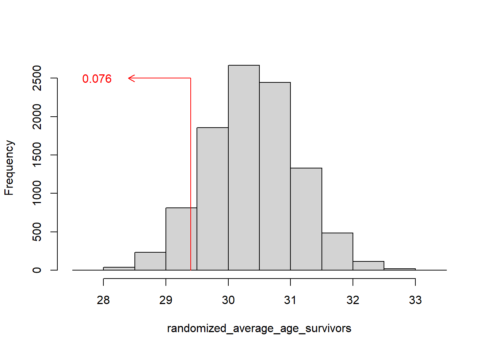

```{r setup, echo=FALSE}
knitr::opts_chunk$set(
  fig.width=6,
  fig.height=3,
  echo=FALSE,
  message=FALSE,
  warning=FALSE)
suppressMessages(
  suppressWarnings(
    library(tidyverse)
  )
)
```

### Where this fits


<div class="notes">

Most of you should be familiar with the components and stages that The Analysis Factor uses to classify their talks. This talk is in Stage 3, Extensions of Linear Models. It covers a pretty broad swath, but might be considered as interpreting results. Perhaps validating results might be a second component.

</div>

### Goal

For you to have a good understanding of:

+ what randomization and exact tests are,
+ when it is appropriate to use them,
+ the steps to implement them.

The goal is not to cover every possible application of the randomization and exact tests.

<div class="notes">

I want to start with an appreciation of when you might consider using exact or randomization tests. These tests are very general, and I will try to show a variety of applications. If you want to implement these tests yourself, it is not too difficult for simpler hypotheses. For more complex hypotheses, you need some basic programming skills. It is not too difficult, if you know how to use loops inside SAS, R, or Stata.

It's not possible to cover every possible application of exact and randomization tests today. I hope just to get you a bit more comfortable with the methodology in general.

</div>


### Outline of topics

+ Historical origins of Fisher's Exact Test
+ Other exact tests
+ Randomization tests
+ Programming requirements
+ When should you use these tests

<div class="notes">

Here is an outline of the topics you will see today.

First, I will provide a historical overview, with an example derived in 1931, when Statistics was still in its infancy.

</div>

### Historical origins of Fisher's Exact Test


<div class="notes">

Let's start with a historical overview. Ronald Fisher was a pioneer in the field of statistics. He developed many foundational methodologies, such as the use of  designed experiments and p-values.

He does have a checkered past, unfortunately. He was a sharp critic of efforts in the 1950s and 60s to draw a link between cigarette smoking and cancer. He felt, quite wrongly as it turned out, that you could only show a link between smoking and cancer through randomized trials.

Even worse were his blatantly racist views and his support for eugenics. This is the topic for another talk. But I did want to highlight a simple experiment he proposed in his 1935 book, The Design of Experiments, known as "The lady testing tea."

This was a simple example of the use of randomization and blinding to test a simple hypothesis.

</div>

### The lady tasting tea, tea plus milk


<div class="notes">

In England, there is an interesting practice of pouring hot tea into a cup and then adding milk. It's not something that I like. Just give me the tea straight. No milk, no sugar, no lemon slices. But tea served with milk is quite popular in England and elsewhere.

</div>

### Milk plus tea, can you tell the difference?


<div class="notes">

You could change the order, though, putting milk in the cup first and then adding the tea.

A colleague of Fisher's, Muriel Bristol, claimed that she could tell, just by tasting, whether a cup had the tea first with milk added or milk first with tea added. She preferred the latter. When she told Fisher this, he scoffed and said that no one could tell the difference between tea with milk added and milk with tea added. Along with another colleague, William Roach, they designed an experiment to prove her wrong.

</div>

### The experiment to test the claim


<div class="notes">

Fisher and Roach prepared eight cups of tea, four with the tea added first and four with the milk added first. They presented the eight cups to Bristol in a random order and had her taste each cup and identify which of the four had milk added first.

</div>

### The result of the experiment


<div class="notes">

To their surprise, after tasting all eight cups, she correctly identified the four cups that had the milk added first. This is indeed a surprising results, but how surprising?

</div>

### How likely is this result?

+ $\frac{4}{8} \times \frac{3}{7}  \times \frac{2}{6} \times \frac{1}{5} = \frac{1}{70}$
  + Note: the probability is NOT $\left(\frac{1}{2}\right)^4$

<div class="notes">

If Bristol had no ability to tell whether the milk was added first and was effectively picking at random, for the first choice, the probability would be 50-50 or four out of eight, since there were the same number of cups with tea added first and milk added first.

If she picked this correctly, the chances that her second selection would be correct, assuming that she was choosing randomly would be 3/7 since only three of the remaining seven cups had the mill added first. It gets even harder for the third choice, assuming that she got the first two correct. There are only two cups now with milk added first out of the remaining six. The last choice is the hardest of all. The probability is one out of five, assuming she got the first three correct. Multiply these four probabilities to get 1/70. So this is quite surprising indeed. If she had no clue which cups had the milk added first, it would take quite a streak of good luck for her to correctly identify four in a row.

Now notice that the probability is not 1/2 raised to the fourth power. The probabilities change because once a cup is identified correctly, it is taken out of the pool of cups. This is analogous to the concept sampling without replacement.

</div>

### Break #1

What have you learned?
+ Simple application of Fisher's Exact test

What is coming next?
+ The hypergeometric distribution

Any questions?

### An alternate result


<div class="notes">

To make things interesting, let's propose a different result. Suppose the Bristol was missed on one cup but identifed three others correctly.

</div>

### How likely is three correct results?

$\frac{4}{8} \times \frac{4}{7}  \times \frac{3}{6} \times \frac{2}{5} \ \ + \ \ \frac{4}{8} \times \frac{4}{7}  \times \frac{3}{6} \times \frac{2}{5} \ \ +\ \ ...$

Too messy! Use the hypergeometric distribution. Note: this is NOT a binomial distribution.

<div class="notes">

The calculations get quite a bit messier in this case. There are four probabilities you have to compute here. The probability that the first cup is identified incorrectly and the remaining three are identified incorrectly starts with the same 4/8 because if you are choosing at random there are four cups that you could choose incorrectly. Once this is done, your chances get a little bit better, because there are four cups that would represent a correct choice and only three left that represent an incorrect choice. The other probabilities are computed similarly.

But you have to account for another case, one where the first cup is choosen correctly, the second incorrectly, and the remaining two correctly. This is getting a bit tedious, but you can calculate the probability with a bit of work.

But the dot-dot-dot tells you that you are still not done. There are two more cases to consider: one where the third cup chosen is the one that is mistaken and one where the mistake happens on the last cup.

Now I don't mind tedious. Tedious is part of being a statistician. But there is a simpler way. You can rely on a well known distribution, the hypergeometric distribution, to calculate the probabilities for you.

</div>

### Balls in an urn analogy

```{}

 |    W           |
 |       B        |
 |  B        B    |
 |          W     |
 |     W       B  |
 |        W       |
 __________________

```

<div class="notes">

To understand the hypergeometric distribution, you need to visualize an abstract problem of probability known as drawing balls from an urn.

Think of the eight cups of tea as an urn with eight balls, four white and four black. The white balls represent correctly identifying the cup of tea as having the milk added first. The black balls represent mistakes in identification. So what is the probability of getting 3 white balls after drawing 4 balls without replacement?

</div>

### Formula for hypergeometric probabilities

$$\frac{{w_1 \choose w_0} {b_1 \choose b_0}}{n_1 \choose n_0}$$

+ $w_1$ = # of white balls in the urn
+ $b_1$ = # of black balls in the urn
+ $n_1 = w_1+b_1$ = total # of balls in the urn
+ $w_0$ = # white balls drawn from the urn
+ $b_0$ = # black balls drawn from the urn
+ $n_0 = w_0+b_0$ = total # of balls drawn

<div class="notes">

The formula for hypergeometric probabilities uses combinatorics. Say that you want to get the probability of drawing w0 white balls and b0 black balls with n0 draws from an urn containing w1 white balls and b1 black balls (n1 balls total). Then it is W1 choose w0 times b1 choose b0 divided by n1 choose n0 where "choose" is the number of combinations. So the denominator, n1 choose n0, is n1 factorial divided by n0 factorial times (n1-n0) factorial.

</div>

### Functions for computing hypergeometric probabilities

+ SAS: PDF('HYPER', w0, n1, w1, n0)
+ R: dhyper(w0, w1, b1, n0)
+ Stata: dis hypergeometricp(n1, w1, n0, w0)
+ SPSS: PDF.HYPER(w0, n1, w1, n0)
  
<div class="notes">

The functions to calculate hypergeometric probabilities vary from package to package. SAS uses a PDF function (short for Probability Density Function) with the 'HYPER' argument. R uses the dhyper function. Stata uses dis hypergeometricp. SPSS uses the PDF.HYPER function.

All of these packages arrange the numeric arguments differently.

Notice that R asks you to specify the number of white balls and the number of black balls. The other packages ask you to specify the number of white balls and the total number of balls, The order that you specify these values in is also inconsistent from package to package.

I show this to emphasize that if you plan to calculate hypergeometric probabilities, read the manual closely. 
Fortunately, while it helps to understand that Fisher's Exact Test relies on  hypergeometric probabilities, you don't have to calculate those probabilities yourself. We'll show that in just a minute.as you will see in a minute.

</div>

### Break #2

What have you learned?
+ The hypergeometric distribution

What is coming next?
+ Using SPSS and Stata

<div class="notes">


</div>

### SPSS data for Fisher's Exact Test


### SPSS dialog boxes for Fisher's Exact Test (1/2)


<div class="notes">


</div>

### SPSS dialog boxes for Fisher's Exact Test (2/2)


<div class="notes">


</div>

### SPSS output for Fisher's Exact Test


### Stata data for Fisher's Exact Test


<div class="notes">


</div>

### Stata code and output for Fisher's Exact Test

```{}
. tabulate guess truth, exact

        Fisher's exact = 0.486
1-sided Fisher's exact = 0.243
```

<div class="notes">


</div>

### SAS and R code for Fisher's Exact test

In SAS,

```{}
proc freq;
  tables guess*truth / fisher;
run;
```

In R,

```{}
fisher.test(guess, truth)
```

<div class="notes">


</div>

### Break #3

What have you learned?
+ Using SPSS and Stata

What's coming next?
+ Details on the p-value computation

### Recall the definition of a p-value

p-value=P[sample results or more extreme| H0]

What does "more extreme" mean?

<div class="notes">


</div>

### List all possible 2 by 2 tables

+ Restricted to common marginal totals
  
```{}
  ? ? | 4
  ? ? | 4
  ----+--
  4 4 | 8
```

<div class="notes">


</div>

### There are five tables with the same marginal totals

```{}
 4  0    3  1    2  2    1  3    0  4
 0  4    1  3    2  2    3  1    4  0
 
0.014   0.229   0.514   0.229   0.014
```

<div class="notes">


</div>

### Consider only tables that are more extreme

For a one-sided p-value

```{}
 4  0    3  1
 0  4    1  3
 
0.014 + 0.229

p-value = 0.243
```

<div class="notes">


</div>

### More extreme tables for a two-sided test

For a two sided p-value

```{}
 4  0    3  1            1  3    0  4
 0  4    1  3            3  1    4  0
 
0.014 + 0.229     +     0.229 + 0.014

p-value = 0.486
```

<div class="notes">


</div>

### Break #4

What have you learned?
+ Details on the p-value computation

What's coming next?
+ More exact tests

### Fisher-Freeman-Halton test

+ Generalization of Fisher's Exact test
+ Tabulate all possible R by C tables
  + Fixed row and column totals
  
<div class="notes">


</div>

### R code for Fisher-Freeman-Halton test

```{}
> v <- c(4, 0, 0, 0, 4, 0, 0, 0, 4)
> m <- matrix(v, nrow=3)
> m
     [,1] [,2] [,3]
[1,]    4    0    0
[2,]    0    4    0
[3,]    0    0    4
```

<div class="notes">


</div>

### R output for Fisher-Freeman-Halton test in R

```{}
> fisher.test(m)

	Fisher's Exact Test for Count Data

data:  m
p-value = 0.0001732
alternative hypothesis: two.sided 
```

<div class="notes">


</div>

### Code for R, Stata, SPSS

+ SAS: Same as for a 2 by 2 table.
+ Stata: Same as for a 2 by 2 table.
+ SPSS: Same as for a 2 by 2 table.

<div class="notes">


</div>

### Mann-Whitney U

Hypothetical data

```{}
T: 14, 23, 37
C: 12, 13, 15, 25
```

<div class="notes">


</div>

### Rank the data

```{}
T:  3,  5,  7
C:  1,  2,  4,  6
```

<div class="notes">


</div>

### Sum of the ranks

```{}
T = 15
C = 13
```

How likely is this result under the null hypothesis?

<div class="notes">


</div>

### List all possible ranking for T

```{}
1,2,3  1,2,4  1,2,5  1,2,6  1,2,7
1,3,4  1,3,5  1,3,6  1,3,7  1,4,5
1,4,6  1,4,7  1,5,6  1,5,7  1,6,7
2,3,4  2,3,5  2,3,6  2,3,7  2,4,5
2,4,6  2,4,7  2,5,6  2,5,7  2,6,7
3,4,5  3,4,6  3,4,7  3,5,6  3,5,7
3,6,7  4,5,6  4,5,7  4,6,7  5,6,7
```

<div class="notes">


</div>

### Select more extreme rankings

```{}


                            2,6,7
                            3,5,7
3,6,7  4,5,6  4,5,7  4,6,7  5,6,7
```

p-value = 7/35 = 0.20

<div class="notes">


</div>

### More extreme rankings for a two-sided test

```{}
1,2,3  1,2,4  1,2,5  1,2,6
1,3,4  1,3,5

2,3,4
                            2,6,7
                            3,5,7
3,6,7  4,5,6  4,5,7  4,6,7  5,6,7
```

p-value = 14/35 = 0.40

<div class="notes">


</div>

### SAS code for Mann-Whitney test in SAS

```{}
proc npar1way wilcoxon;
  class grp;
  var x;
  exact wilcoxon;
run;
```

<div class="notes">


</div>

### SAS output for Mann-Whitney test (1/2)


<div class="notes">


</div>

### SAS output for Mann-Whitney test (2/2)


<div class="notes">


</div>

### R, Stata, and SPSS

+ R: wilcox.test
+ Stata: ranksum
+ SPSS: Analyze, Nonparametric tests, Independent Samples

<div class="notes">

In SPSS, choose Analyze, Nonparametric tests, Independent Samples from the menu.

In R use, the wilcox.test function.

In Stata, use the `ranksum` command.

</div>

### Still more exact tests

+ General algorithm
  + Assume a null hypothesis
  + List all possible outcomes
  + Find probabilities for each
  + Add up as extreme or more extreme probabilities
+ StatXact software

<div class="notes">

There are literally hundreds of possibilities for the use of exact test. Most involve discrete distributions or the use of nonparametric approaches like ranking.

The general algorithm is to assume a null hypothesis. In the lady tasting tea, the null hypothesis is that the guesses are totally random. For the Mann-Whitney test, the null hypothesis is that all possible rankings are equally likely. Then list every possible outcome and attach a probability to each outcome. Then figure out which outcomes are as extreme or more extreme than your outcome and add up all the probabilities associated with those outcomes. That is your p-value.

If you find a setting where you want an exact test, but you can't find one in your software, you might consider a package, StatXact, that can do literally hundreds of exact tests. The programmers at StatXact have figured out really efficient algorithms for listing all possible outcomes, even when the sample size is not trivially small.

</div>

### Break #5

### Randomization tests

+ Impractical to list all possible outcomes
+ Randomly sample instead

<div class="notes">


</div>

### Titanic data

```{}
 	    Alive	 Dead	 Total
Female	308	  154	   462
Male	  142	  709	   851
Total	  450	  863  1,313

Average age
  Alive 29.4
  Dead  31.1
```

### Titanic data

```{r, eval=FALSE}
randomized_number_male_survivors <- rep(NA, 10000)
randomized_average_age_survivors <- rep(NA, 10000)
for (i in 1:10000) {
  randomized_male_survivors[i] <- sum(sample(t$Sex, 450)=="male")
  randomized_average_age_survivors[i] <- mean(sample(t$Age, 450), na.rm=TRUE)
}
```

### Titanic data


### Titanic data




### Break #6

### Randomization test


### Randomization test


### Randomization test


### Break 

### When should you use exact or randomization tests?


### Conclusion
