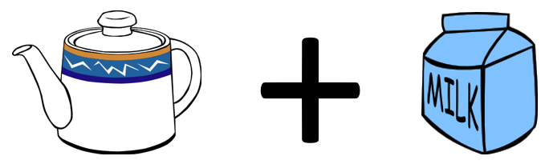

```{r setup, echo=FALSE}
knitr::opts_chunk$set(
  fig.width=6,
  fig.height=3,
  echo=FALSE,
  message=FALSE,
  warning=FALSE)
suppressMessages(
  suppressWarnings(
    library(tidyverse)
  )
)
```

### Where this fits


<div class="notes">

Most of you should be familiar with the components and stages that The Analysis Factor uses to classify their talks. This talk is in Stage 3, Extensions of Linear Models. It covers a pretty broad swath, but might be considered as interpreting results. Perhaps validating results might be a second component.

</div>

### Goal

For you to have a good understanding of:

+ what randomization and exact tests are,
+ when it is appropriate to use them,
+ the steps to implement them.

The goal is not to cover every possible application of the randomization and exact tests.

<div class="notes">

I want to start with an appreciation of when you might consider using exact or randomization tests. These tests are very general, and I will try to show a variety of applications. If you want to implement these tests yourself, it is not too difficult for simpler hypotheses. For more complex hypotheses, you need some basic programming skills. It is not too difficult, if you know how to use loops inside SAS, R, or Stata.

It's not possible to cover every possible application of exact and randomization tests today. I hope just to get you a bit more comfortable with the methodology in general.

</div>


### What you'll learn today

+ Historical origins
+ Fisher's Exact Test
+ Other exact tests
+ Ranomization tests
+ Three specific randomization tests
+ Programming requirements
+ When should you use these tests

<div class="notes">

First, I will provide a historical overview, with an example derived in 1931, when Statistics was still in its infancy.
</div>

### 1. Historical origins


<div class="notes">

Let's start with a historical overview.

</div>

### The lady tasting tea



<div class="notes">


</div>

### If you change the order?


<div class="notes">


</div>

### The experiment


<div class="notes">


</div>

### The result


<div class="notes">


</div>

### How likely is this result?

If the lady had no ability to tell whether the milk was added first and was effectively picking at random, the probability would be

$\frac{4}{8} \times \frac{3}{7}  \times \frac{2}{6} \times \frac{1}{5} = \frac{1}{70}$

<div class="notes">


</div>