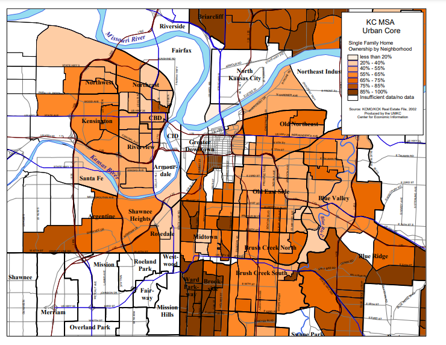
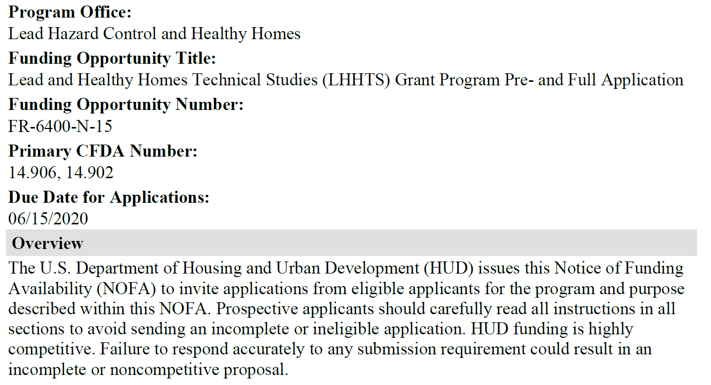

### How this all started

Back in 2018, the new Provost, Mauli Agrawal, convened a series of meetings for a group of people interested in data science. The goal was to talk about new research and teaching activities in this area. At the end of the meeting, Doug Bowles, stopped and talked to me about possibly helping with the work at a group he was running, the Center for Economic Information.

### The Center for Economic Information

The Center for Economic Information was started in 1994 and has worked with neighborhoods and communities in the Kansas City metropolitan area to provide them with data from a variety sources, including the Bureau of the Census.

### Single family home ownership by neighborhood

Here's a map showing single family home ownership by neighborhood.

### Neighborhood housing condition survey (1/2)

+ Fifteen ratings in three categories
  + Structure
  + Grounds
  + Infrastructure
+ Classification of the parcel
  

A major effort of CEI has been their development and validation of the neighborhood housing conditions survey (NHCS). This survey provides ratings for parcels: residential housing and other structures including vacant lots. The survey uses an five point ordinal rating of fifteen elements related to the quality of a housing unit. These address the structure of house itself (such as conditions of the roof, porch, and exterior paint), the grounds around the house (such as the lawn, litter, and open storage) and the  infrastructure (such as the sidewalk, curbs, and street lights).

### Neighborhood housing condition survey (2/2)

+ Evaluation done at the street level
  + IRB review: exempt
    + Observations in a public setting
  + Relatively inexpensive
  + Broad coverage across neighborhoods and years
    + 22 surveys from 2000 through 2014
    + 260,000 homes surveyed
+ Does the home environment influence health?
  + YES!!!
  

CEI researchers in teams of two. The driver went slowly down the street and the researcher riding shotgun entered data on each house along the street.

Because this data collection involved observations in a public setting, the IRB quickly determined that this study was exempt.

It is relatively inexpensive, about $6 per house, when all the costs are accounted for.

The survey provided a ton of data. Over a fifteen year period, CEI collected data on over 260,000 houses.

The home in which you live affects many aspects of your social and economic well being. Can it affect your health as well. The answer is a strong YES!

Much of my early work with CEI involved providing informal support to two students working at CEI. Both produced dissertations that addressed the influence of housing quality on health.

### Natalie Kane, asthma

Natalie Kane, pictured here, wrote a dissertation examining how asthma can be exacerbated by poor housing conditions and other environmental variables such as proximity to point sources of pollution. The title of her dissertation is "An Interdisciplinary Approach to Health Disparities Research and Intervention: The Case of Childhood Asthma in Kansas City"

She graduated from UMKC in 2020, worked as a post-doc at Children's Mercy under the direction of Mark Hoffman, and is now working for My Sidewalk, an organization helping communities to access data useful for planning and lobbying efforts.

I offered some informal advice about some Bayesian models she was using. She actually had done everything quite well, so my job was mostly explaining how to interpret these models and how to display her results properly.

### Neal Wilson, lead poisoning

Neal Wilson, pictured here, wrote a dissertation looking at lead poisoning in children. The title of his dissertation is "Childhood Lead Poisoning and the Built Environment in Kansas City, Missouri, 2000-2013". He graduated in 2021 and is currently the Associate Director for CEI. He also teaches Introduction to Economics and Economic History at the California Institute of the Arts.

Like Dr. Kane, Dr. Wilson used a Bayesian model in his research and I provided some informal advice.

### Housing and Urban Development

In the summer of 2020, I worked on a grant with CEI and partners at Children's Mercy and the Kansas City, Missouri Department of Health. We also worked on a second grant with the National Center for Healthy Housing, but that didn't get funded, so I won't discuss it further here.

### Notice of Funding Availability (FR-6400-N-15)

Here's the first page of the notice of funding availability (NOFA) for the grant we applied to. NOFA is an acronym for Housing and Urban Development. 

You'll see other acronyms like RFA for NIH.

Here's a pop quiz. Put your answer in the chat box: What's the difference between an FOA, PA, RFA, and RFP

Don't bother trying to read the NOFA here on this screen. A Google search of FR-6400-N-15 would bring it up if you are curious.

This NOFA is 68 pages long and everyone involved with writing this grant read through all 68 pages multiple times. I can't stress enough how important it is to read the NOFA.

In the first paragraph of the NOFA, HUD states that "Failure to respond accurately to any submission requirement could result in an incomplete or noncompetitive proposal."

Let's take a quick look at a few of these submission requirements.

### Grant proposal guidelines

+ Eligible applicants
  + Priority applicants
+ Unfundable applications
+ Priority research topics

Most calls for grants will list who is eligible to apply for the grant. Take special note of any priority applicants. This particular grant gives some priority to new applicants. Others may give priority to young researchers or researchers from Historically Black Colleges and Universities. If you fall into a priority group, make sure that the granting agency knows this.

Most calls for grants will also list things that they will not fund. The HUD grant would not fund "applications that involve laboratory testing on living organisms with the exception of laboratory testing on animals that are residential pests (e.g., cockroaches, bed bugs, mice, etc.)"

The NOFA mentions numerous priority topics. One of them relevant to our application is "Evaluation of the effectiveness of specific residential lead hazard control interventions."

### Pre-application

+ Cover sheet
+ 200 word or less abstract
+ Five page narrative
+ Biosketches
  + Up to three key personnel
  + One page limit per biosketch
+ Estimated total funding

HUD does something that I wish more granting agencies would do. HUD asks you to submit a pre-application and only those proposals that score highly on the pre-application will be asked to produce a lengthier and more detailed proposal.

The structure and the page limits are very important here. There are restrictions on margins and font sizes. HUD notes that any pages in excess of the page limit will not be considered in evaluating the pre-proposal or full proposal.

### Full application

+ Proposal (25 page limit)
+ Abstract, two pages
+ Resumes, three pages per resume
+ Organizational chart
+ Letters of commitment
+ Bibliography
+ Additional materials/appendices, 20 page limit
+ Budget using form HUD424CBW

While the limit for the proposal is 25 pages, there are additional items outside this page limit. Most of these have their own limits.

### Rating factors (100 points possible)

+ Capacity of the Applicant and Relevant Organizational Experience: Two elements (13 + 7 = 20 points)
+ Need for the research: Five elements (12 + 4 + 7 + 4 + 4 = 31 points)
+ Soundness of Approach: Four elements (20 + 5 + 1 + 5 = 31 points)
+ Leveraging Resources: One element (6 points)
+ Achieving Results and Project Management: Four elements (3 + 6 + 2 + 1 = 12 points)

HUD provides a rating system for grants with various points for each element. You want to make sure that you document anything that addresses any element, no matter how small. The National Center for Healthy Housing grant that we collaborated on--it missed being funded by a single point.
  

### Examples of our focus (1/2)

+ Quality assurance plan (5 points)
  + You must describe the quality assurance mechanisms that will be integrated into your project design to ensure the validity and quality of the results. Applicants that receive awards will be required to submit a quality assurance plan to HUD. You should plan for this and include quality assurance activities in your study work plan.
  

One of the elements under "Soundness of Approach" is "Quality assurance plan." This is something that should be part of every research study, but when HUD specifically asked for it, you absolutely, positively must respond. 

We made sure to document a solid quality assurance plan. We even designated a quality assurance role for one of the invesigators.

  
### Examples of our focus (2/2)

+ Leveraging resources (6 points)
  + This factor addresses your ability to obtain other resources that can be combined with HUD’s funding to increase the effectiveness of the proposed study. To receive points, your proposal should demonstrate that the effectiveness of HUD’s Technical Studies grant funds is being increased by securing other resources or by structuring the study in a cost-effective manner, such as integrating the work into an existing study that will be concurrent with your proposed study.

The fourth rating factor was "Leveraging resources." It is not too surprising that HUD would want to provide better ratings for those grants that could take advantage of other resources to supplement the research.

It was tricky to attach a dollar value to it, but we claimed the neighborhood housing conditions survey data and a resources that would be combined with additional data to increase the effectiveness of the proposal.

### Break

+ Neal Wilson will talk now
  + Building a research team
  + Aim 1 of the grant
+ Then I will return
  + Aim 2 of the grant  

### Aim 2

+ Validate use of exterior survey to identify high risk homes
  + Conduct survey in 60 census tracts
  + Select 50 houses with high score on survey
  + Compare to 50 neighboring control houses

Our agenda is to develop a primary prevention technique based on exterior housing observations as well as neighborhood level social determinants of health. The goal will be to develop a data-driven, housing-based index that Lead Hazard Control programs can use to select the homes most in need of lead-based hazard remediation.

The exterior based housing survey was developed by the Center for Economic Information and used in many Kansas City Missouri and Kansas City Kansas neighborhoods over the past two decades. It can be conducted by graduate students after a carefully established training program. The individual items in the survey, such as roofing condition are easily observed at the street level and can be done quickly and accurately. Our team has built extensive quality control procedures into the survey. It can be done quickly and cheaply. Our team has collected data on over 260 thousand houses over a 14 year period.

### Strengths of the research

+ Leverage existing resources to solve new problems
+ Use of cost-effective methods
+ Extensive QC already in place
+ Approach easily extended to other communities

we're quite proud of the proposal that we put together and see three major strengths of this research. 

First, we are leveraging existing resources in this research. We have extensive data from the KC Lead Safe project and will use that to evaluate the long term success of lead remediation. We have an established methodology for surveying the exterior conditions of a house and expect that this will be predictive of interior conditions as well.

Second, we are proposing cost effective methods for this work. The exterior conditions survey is fast, convenient, and inexpensive. We hope to show that this simple survey will allow a cost-effective approach to identify where to best spend remediation efforts.

Third, we have detailed quality control procedures already in place for these procedures. There is a detailed training protocol, for example, for the exterior house conditions survey, and duplicate assessment of all survey items.

Finally, if the approach we propose is proven by the research data, it would take very little effort to package up the work and apply it to other communities in the United States.

