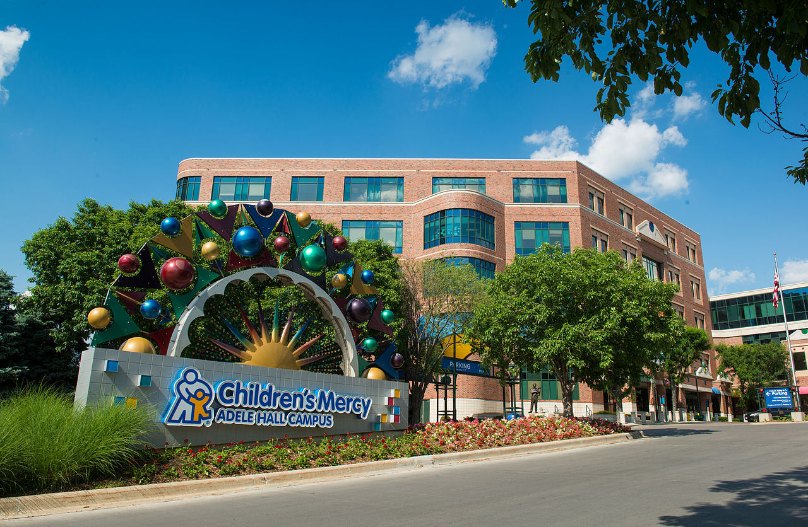

### Collaborative effort

Our other partner is the Environmental Health  at Children's Mercy Hospital.

Source of image: 
  https://en.wikipedia.org/wiki/Children%27s_Mercy_Hospital

### Collaborative effort

Let me start by emphasizing the collaborative effort of this work. We are working with the Childhood Lead Poisoning Prevention Program at the Kansas City Department of Health.

Source of image:
  https://www.kcur.org/health/2015-10-29/kansas-city-wins-national-award-for-culture-of-health

### Collaborative effort

At the University of Missouri-Kansas City, the work will be done at the Center for Economic Information.

Source of image:
  https://www.kcur.org/education/2020-04-24/umkc-plans-for-students-to-return-to-campus-in-fall-tells-staff-to-prepare-for-layoffs-furloughs-now

### Leveraging existing resources

+ Project Lead Safe Kansas City
  + 20 years of data
  + 18 thousand health encounters per year
+ Exterior based housing survey
  + Quick, easy, cost effective ($6.50 per parcel)
  + Can be done at the street level
  + Extensive quality control procedures
  + Used routinely for over 260 thousand houses over 14 years.

The work we propose takes advantage of two key resources that already exist. The first is data from the Lead Safe Kansas City project. This program, funded by HUD, tests children for lead poisoning, home testing, and remediates if lead hazards are found. There is a massive amount of information from this project, 20 years worth of data and 18 thousand health encounters per year.

The second resource is an exterior based housing survey developed by the Center for Economic Information and used in many Kansas City Missouri and Kansas City Kansas neighborhoods over the past two decades. It can be conducted by graduate students after a carefully established training program. The individual items in the survey, such as roofing condition are easily observed at the street level and can be done quickly and accurately. Our team has built extensive quality control procedures into the survey. It can be done quickly and cheaply. Our team has collected data on over 260 thousand houses over a 14 year period.

### Aim 1. 

+ Quantify improvements made by KC Lead Safe
  + Trends over time versus national trends
  + Identify and evaluate children who move into remediated homes.

We will describe the extent to which different interventions have made housing lead safe by HUD standards and how this leads to fewer lead poisoned children among those who move into a home after remediation activity.

### Aim 2

+ Validate use of exterior survey to identify high risk homes
  + Conduct survey in 60 census tracts
  + Select 50 houses with high score on survey
  + Compare to 50 neighboring control houses

Our agenda is to develop a primary prevention technique based on exterior housing observations as well as neighborhood level social determinants of health. The goal will be to develop a data-driven, housing-based index that Lead Hazard Control programs can use to select the homes most in need of lead-based hazard remediation.

### Strengths of the research

+ Leverage existing resources to solve new problems
+ Use of cost-effective methods
+ Extensive QC already in place
+ Approach easily extended to other communities

we're quite proud of the proposal that we put together and see three major strengths of this research. 

First, we are leveraging existing resources in this research. We have extensive data from the KC Lead Safe project and will use that to evaluate the long term success of lead remediation. We have an established methodology for surveying the exterior conditions of a house and expect that this will be predictive of interior conditions as well.

Second, we are proposing cost effective methods for this work. The exterior conditions survey is fast, convenient, and inexpensive. We hope to show that this simple survey will allow a cost-effective approach to identify where to best spend remediation efforts.

Third, we have detailed quality control procedures already in place for these procedures. There is a detailed training protocol, for example, for the exterior house conditions survey, and duplicate assessment of all survey items.

Finally, if the approach we propose is proven by the research data, it would take very little effort to package up the work and apply it to other communities in the United States.

### Documentation

This PowerPoint file was written on 2021-01-08 and last modified on `r Sys.Date()`. It was generated using R Markdown. You can find the R Markdown code at

+ https://github.com/pmean/papers-and-presentations/blob/master/kc-lead-impact/src/regional-office-presentation.Rmd