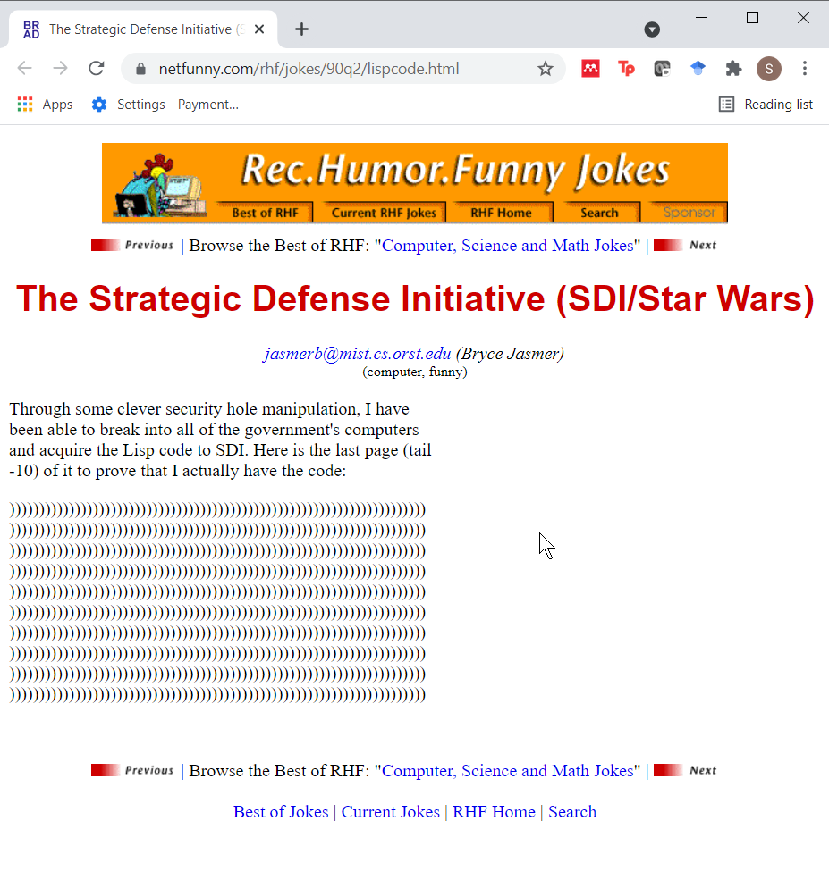

### Overview

+ infix operators
+ invasion of the tidys
  + ggplot2
  + dplyr
  + purr
  + magrittr
+ simple pipe examples
  + vector in frequency order
  
<div class="notes">

author: Steve Simon

purpose: to illustrate the use of pipes in the maggrittr package

license: public domain

I want to talk about the pipe operator in the magirttr package. First, I'll review infix operators, and talk about how a group of programmers led by Hadley Wickham have hijacked the R programming language and re-oriented it in strange ways. 

</div>

### The infix operator

+ A function that does not look like a function.
+ Examples: +, -, *, /, ^, %%, %/%, :

```{r}
1+2
`+`(1, 2)
```

<div class="notes">

R has a class of functions known as infix operators. These are functions that allow a shorthand approach to programming that allows you to specify many computations using an algrebra-like syntax. The "+" operator, for example is a function that takes what is to the left of the + sign as the first argument, what is to the right of the + sign as the second argument and the function adds the two arguments together.

You can show the infix operator as a more traditional function by surrounding it with backticks.

</div>

### Defining your own infix operators

+ Must start and end with %

```{r}
`%s%` <- function(x, y) {paste(x, y, sep="/")}
path <- "../data"
filename <- "small-dataset.csv"
read.csv(path %s% filename)
```

<div class="notes">

You can define your own infix operators. They must start and end wit the percent sign. Here's an example I have used. I often specify a file and its location in two separate variables. I then need to combine them into a single string with a slash in between the path and the filename. I do this often enough that I can save a bit of typing using a function %s%. This code shows how I defined that function and use it in a practical setting.

</div>

### Invasion of the tidys

+ Hadley Wickham and others
+ Redefine R
  + tidyverse
+ Largely unrecognizable to traditional R programmers
+ Examples
  + ggplot2
  + dplyr
  + purrr
  + magrittr

<div class="notes">

Over the past ten years, a team of programmers led by Hadley Wickham have developed a series of packages that fundamentally redefine the R programming language. This effort has been tagged with the name "tidyverse." The packages have created a variant of R that is largely unrecognizable to R programmers.

Here are some examples of packages in the tidyverse that radically change the R programming language.

</div>

### Magrittr


<div class="notes">

By Image taken from a University of Alabama site, "Approaches to Modernism": [1], Fair use, https://en.wikipedia.org/w/index.php?curid=555365

First a historical note. The name "magrittr" is a play on the name of a famous surrealist artist, [Rene Magritte](https://en.wikipedia.org/wiki/Ren%C3%A9_Magritte), who included a quote "Ceci n'est pas une pipe" (This is not a pipe) in one of his [paintings](https://en.wikipedia.org/wiki/The_Treachery_of_Images).

</div>


### Definition of a pipe

+ x %>% f is equivalent to f(x)
+ x %>% f(y) is equivalent to f(x, y)
+ x %>% f %>% g %>% h is equivalent to h(g(f(x)))

<div class="notes">

I've recently started using the magrittr package a lot in my R programs. This package implements the pipe operator %>%. A very simple explanation of how the pipe operator works is found in the [README file](https://cran.r-project.org/web/packages/magrittr/README.html) of the package.

</div>

### Why use pipes

+ Reduces the number of parentheses
+ Untangles the mess of nested functions
+ Avoids repetitive data frame references

<div class="notes">

The first time I saw this, I was scratching my head and wondering "Why?". It turns out that there are several reasons for using the pipe operator.

</div>


### Nested parentheses.



<div class="notes">

There's a [cute joke about LISP](http://www.netfunny.com/rhf/jokes/90q2/lispcode.html) that emphasizes the problems with nested parentheses in that language. 

Through some clever security hole manipulation, I have been able to break into all of the government's computers and acquire the Lisp code to SDI. Here is the last page (tail -10) of it to prove that I actually have the code:

R is not quite that bad, but it can have a lot of parentheses.

</div>

### Example of nested functions and parentheses (1)

+ First, create an artificial data frame.

```{r create_data_frame}
tst <- data.frame(i=1:10, x=rep(letters[1:4], c(2,1,4,3)), stringsAsFactors=FALSE)
tst
```

<div class="notes">

Here's an example.

You want to get a vector listing all the possible values of a column in a data frame, but with the values listed in order from the one that occurs most frequently to the one that appears least frequently. Let's do this in steps.

</div>

### Example of nested functions and parentheses (2)

```{r table}
table(tst$x)
```

<div class="notes">

Get the frequency counts with the table function.

</div>

### Example of nested functions and parentheses (3)

```{r sort}
sort(table(tst$x))
```

<div class="notes">

Then you sort the table.

</div>

### Example of nested functions and parentheses (4)

```{r rev}
rev(sort(table(tst$x)))
```

<div class="notes">

Almost there. The sort command goes from low to high. You want to go from high to low. Use the rev command to do this.

</div>

### Example of nested functions and parentheses (5)

```{r names}
names(rev(sort(table(tst$x))))
```

<div class="notes">

One last thing. The table is the frequency counts, but we want the actual values. Use the names command.

There are several problems with this. First the mass of parentheses makes it easy to end up with mismatched parentheses. Second, it is modify this code. Third, the code is hard to read. Here's how you would do this with pipes.

</div>

### Recode using pipes (1)

```{r pipes_table}
suppressMessages(suppressWarnings(library(magrittr)))
tst$x %>% table
```

<div class="notes">

First put the vector into the table function.

You could have written this as tst$x %>% table() but the parentheses are not needed. To add a second function, just add a second pipe operator. With multiple pipe operators, you can make the code a bit easier to read by splitting the command onto multiple lines.

</div>

### Recode using pipes (2)

```{r pipes_sort}
tst$x   %>%
  table %>%
  sort
```

<div class="notes">

Take the output from table and put it into the sort function.

</div>

### Recode using pipes (3)

```{r pipes_rev}
tst$x   %>%
  table %>%
  sort  %>%
  rev
```

<div class="notes">

Reverse the order.

</div>

### Recode using pipes (4)

```{r pipes_names}
tst$x   %>%
  table %>%
  sort  %>%
  rev   %>%
  names
```

<div class="notes">

and get the names.

</div>

### Recode using pipes (5)

```{r pipes_assignment}
tst$x   %>%
  table %>%
  sort  %>%
  rev   %>%
  names  -> top_values
top_values
```

<div class="notes">

If you need to takek the results of a series of pipes and store it in a vector for later use, I have found that the alternate assignment operator -> to be very useful.

</div>

### Avoiding repeat typing of data frame names (1)

```{r substitute}
tst1 <- tst[tst$x=="c", ]
tst1
```

<div class="notes">

One commonly offered advice for new R programmers is to keep the names of your data frames very short. The reason for this is that you often end up typing the data frame names multiple times even within a single command. Here is an example. Suppose you want to change the values of "c" in the data frame to "e" but keep everything else the same. The R code to do this is

</div>

### Avoiding repeat typing of data frame names (2)

```{r filter}
suppressMessages(suppressWarnings(library(dplyr)))
tst %>% filter(x=="c") -> tst1
tst1
```

<div class="notes">

There are various workarounds for this, such as the attach and with commmands, but these have issues. Here's a solution using magrittr. It relies on a function in the dply library, filter.

Now you might think, Big Deal, one less tst. But it is a big deal when you have to do this multiple times.
 
</div>

### Transformations (1)

```{r log}
tst2 <- tst
tst2$i_squared=tst2$i^2
tst2
```

<div class="notes">

Another time when data frame names get in the way is when you need to compute a transformation.

</div>

### Transformations (2)

```{r mutate}
tst %>% mutate(i_squared=i^2) -> tst2
tst2
```

<div class="notes">

With pipes and the mutate function in dplyr, this becomes a lot easier.

</div>

### Combine 

```{r combine}
tst                     %>%
  filter(x=="c")        %>%
  mutate(i_squared=i^2) -> tst2
tst2
```

<div class="notes">

Of course, the biggest advantage of pipes is when you need to combine several operations. So let's filter the data set and then mutate it.

These are all very simple examples, but I have found that using pipes has shortened my code and made it more readable at the same time. It is also easier to maintain and modify my code. To learn more, read the [magirttr vignette](https://cran.r-project.org/web/packages/magrittr/vignettes/magrittr.html) or the [Revolutions blog posting](http://blog.revolutionanalytics.com/2014/07/magrittr-simplifying-r-code-with-pipes.html) or [Chapter 18](http://r4ds.had.co.nz/pipes.html) of the R for Data Science book. I have written about the [sort by frequency example](http://blog.pmean.com/pipes-in-r/) and showed a [a second example](http://blog.pmean.com/pipes-in-r-2/) on my [blog](http://blog.pmean.com).

</div>

