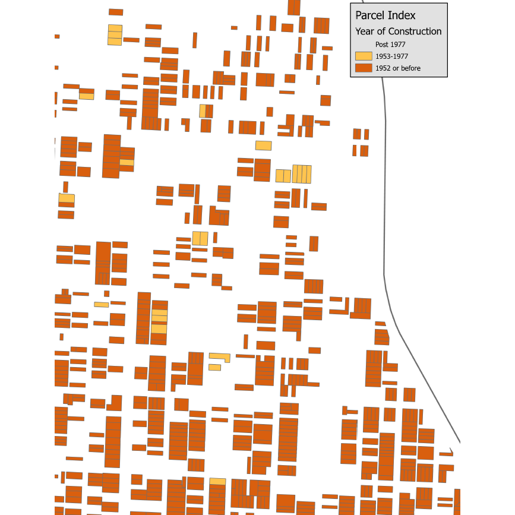

<!---

Presented at the Program Managers Conference in Seattle, WA on 2023-04-17

--->

### My background

+ PhD in Statistics
+ Faculty member
  + Department of Biomedical and Health Informatics
  + Informal consultant with Center for Economic Information (CEI)
  

Before I start my talk, let me fill you in on my background. I am a data geek, with a PhD in Statistics and a faculty appointment in the Department of Biomedical and Health Informatics. I also have been providing informal consulting with the Center for Economic Information (CEI), a research group with expertise in geographic information systems, economic statistics, and big data. with a long history of working with local communities and governments in the Kansas City metropolitan area.

### Acknowledgements

+ Children's Mercy Hospital
  + Ryan Allenbrand, Healthy Home Program Manager
  + Elizabeth Friedman, Medical Director of Environmental Health
  + Kevin Kennedy, Environmental Health Program Director
+ Kansas City, Missouri Department of Health
  + Amy Roberts, Director, Childhood Lead Poisoning Prevention Program

Research is a team sport, and I need to acknowledge my partners in this work at Children's Mercy Hospital and the Kansas City, Missouri Department of Health.

### Acknowledgements

+ University of Missouri-Kansas City
  + Matthew Applebury, Satya Golla, Chinedu Isoh, Mounika Reddy Jakkidi, Brian Matlock, Nomuunzul Munkhjargal, Lori Reierson, Matthew Robinson, Vishal Vejendla, graduate students
  + Doug Bowles, Past Director, Center for Economic Information (retired)
  + Taki Manolakos, Past Director, Center for Economic Information
  + Ricardo Moniz, Education Program Coordinator for Biomedical and Health Informatics
  + Neal Wilson, Deputy Director, Center for Economic Information

I work at the University of Missouri-Kansas City, and we have many others where I work helping out with this research. I should pay special thanks to the army of graduate students who have done all the heavly lifting in the work I am about to describe.

### Impact Lead-Kansas City grant

+ Lead Technical Study funded by HUD
+ Three years, $700,000
+ Aim 1, retrospective review of lead remediation efforts
+ Aim 2, prospective identification of houses at risk for lead contamination
  + Use of Neighborhood Housing Conditions Survey
  + **Potential for collaboration with other HUD grantees**
  

I am the principal investigator on Impact Lead-Kansas City. This is a lead technical study funded by the Department of Housing and Urban Development. We've been funded for three years, 2021 through 2023. I appreciate this invitation to talk about the work on this grant. 

The grant has two aims, a retrospective review of lead remediation efforts funded by HUD through the Kansas City, Missouri Department of Health. and a prospective effort to more efficiently identify houses that might be targets for future remediation.

I want to highlight a key component of the second aim, a survey that we hope will be useful in prospective identification of houses at risk for lead contamination, the Neighborhood Housing Conditions Survey. I am focussing on this survey because it has the potential for collaboration with other HUD grantees at this meeting.

### Overview of the Neighborhood Housing Conditions Survey (NHCS)

+ Windshield survey
+ Features visible at street level
+ Collection primarily of residential parcels

The CEI Neighborhood Housing Conditions Survey (NHCS) is a windshield survey of residential parcels. The parcel geography and other relevant information was provided by the City of Kansas City, Missouri. 

This is windshield survey, which means you collect the data by slowly driving down a street and observing housing conditions that are visible from the street level. You don't have to go inside the house or even step inside the property boundaries.

The primary intent of the survey is to collect conditions of residential structures.  The survey will also note information on non-residential structures and vacant lots.

The survey was developed in 1999 and has been applied continuously through 2014. 

### NHCS classification data

+ Structure type,
+ Use type, 
+ Residential type, 
+ Structure profile, and 
+ Visible address

The housing survey collects two types of data. It collects classification data, information that classifies the type of structure, its use, whether it is residential, the profile of the structure, and the visible address.

### NHCS conditions data

+ Fifteen ratings
  + Structure
  + Grounds
  + Infrastructure

The NHCS also collects data on housing conditions, grouped into conditions about the structure itself, the grounds, and the infrastructure.

The condition of each of these elements is rated on a scale of 1 to 5, with 5 corresponding to the best condition and 1 corresponding to the worst condition.

For parcels with no structure (vacant lots, parking lots, parks) there is only data for the Grounds and Infrastructure conditions. 

### NHCS conditions data on structure

+ Roof 
+ Foundation/walls 
+ Windows/doors 
+ Porch 
+ Exterior Paint 

Ratings are done on five features of the structure itself: the roof, foundation and walls, windows and doolrs, the porch, and exterior paint.

### NHCS conditions data on grounds 

+ Private sidewalk/drive 
+ Lawn/shrubs 
+ Nuisance vehicles 
+ Litter 
+ Open storage 

Ratings are also done on five features of the grounds: the private sidewalk, lawn, nuisance vehicles, litter, and open storage.

### NHCS Infrastructure 

+ Public sidewalk 
+ Curb 
+ Street lighting 
+ Catch basin 
+ Street 

Finally, there are ratings for the infrastructure: the public sidewalk, curb, street lighting, catch basin and street.

### Condition ratings

+ Likert scale (1-5)
  + 1, Severely deteriorated
  + 2, Seriously deteriorated
  + 3, Substandard
  + 4, Good
  + 5, Excellent
+ Missing value codes  
  + 6, not applicable
  + 7, unable to rate

The condition ratings range from 1 to 5 on Likert scale with lower scores indicating more deterioration. A code of 6 is a missing value code for locations where a condition rating is not applicable. A code of 7 is a second missing value code for conditions that could not be rated because of visibility issues.

### Example Structure/roof

1. Severely Deteriorated. There are holes visible through roof sheathing. Rafters are sagging or collapsed. Soffits and fascia boards are missing or display severe rot and deterioration.

I want to show details for one of the fifteen conditions that are rated by the NHCS, so you can see the specificity detailed in this survey.

For the roof of a structure, the lowest rating, 1, represent severe deterioration. These represent pretty extreme conditions like holes in the roof.

### Example Structure/roof

2. Seriously Deteriorated. There are no holes present. The roof has sagging rafters, but sagging is not severe. Roofing shingles are extremely deteriorated. More than five shingles are currently missing on the front exposure of the roof. It appears some sheathing needs to be replaced. Soffits and fascia boards display moderate rot and deterioration.

The next rating, 2, represent serious deterioration. No holes, thank gooodness, but some visible sagging, and/or missing shingles.

### Example Structure/roof

3. Substandard. There are no holes or sagging. Roofing shingles are deteriorated and should be removed before new shingles are installed. Less than five shingles are missing on the entire roof. Soffits and fascia boards display slight rot deterioration.

A rating of 3 represents substandard conditions. This represents a small number of missing shingles or slight rot in soffits and fascia boards.

### Example Structure/roof

4. Good. This represents slight discoloration or the need to repaint soffits and fascia boards.

A rating of 4 represents slight wear and discoloration.

### Example Structure/roof

5. Excellent. Roofing shingles show no wear. Soffits and fascia boards display no rot nor deterioration and are adequately installed.

A rating of 5 is the best rating. No wear, no rot, no deterioriation.

### Example Structure/roof

6. Not applicable. Characteristic does not apply to rated parcel (e.g., roof rating for parcels with no structure).

If there is no structure on the parcel, there is no roof to be rated. This is assigned a code of 6 and this is not used in the overall assessment of housing conditions.

### Example Structure/roof

7. Un-ratable. Characteristic applies to rated parcel, but rating could not be determined (e.g., structures with flat roofs, or where line of sight to roof is obscured by trees).

There's one more case to consider. Sometimes, you cannot provide a rating because the roof is flat or obscured by trees. This is assigned a code of 7 and this is not used in the overall assessment of housing quality.

### Training

+ Classroom session with visual aids
+ Group discussion of a test block
+ Individual survey of two test blocks
  + Trainee ratings compared with expert

The training starts with a classroom session with visual aids. Then the trainees are taken to a test block, chosen for its representativeness of various levels of deterioration. The trainees join in a group discussion with the instructor on the ratings for individual parcels on this test block.

Then the trainees examine two more test blocks individually. Their ratings are compared to those of the instructor and if the average deviation in rating is within plus or minus one rating point, the trainees are certified and able to conduct surveys on their own.

### Quality Control 

+ Tow raters for every parcel
+ Two blocks randomly select from survey data
  + Qualitative agreement on classification data
  + Quantitative agreement on condition data

The NHCS has several quality checks built in. First, and most importantly, there are two independent ratings on every parcel. In addition, two blocks are randomly selected and inspected by an expert who compares their results on both the qualitative classification data and the quantitative condition data. The quantitative data must not deviation on average by more than one rating unit on average.

### Who uses the NHCS

+ Community development corporations
+ City urban planners
+ Real estate agencies
+ Mortgage bankers
+ Construction contractors
+ Insurance companies
+ Neighborhood and community associations

There are a broad range of individuals and groups who are interested in the NHCS data.

I want to focus, though, on the last bullet point, neighborhood and community associations. These groups are very eager to find and use data that will help them advocate on behalf of the places where they live. 

### Research applications of the NHCS

+ Data at the finest level of detail
+ Easy to incorporate with higher level geographies
+ Easy to link with other records
  + Electronic health records
  

I would be remiss in my duties as a data geek if I did not point out the research applications of the NHCS. 

Too many studies of geographic features lump everyone into a large groups, like zip codes or counties. This mixes apples, oranges, and every type of fruit together in a one big batch and pretends that a single summary number can characterize such a diverse group. 

The NHCS, on the other hand, collects data at the finest possible level of social resolution, the household.

You can still be easily incorporated with data at higher level geographies like the American Community Survey which collects data at the Census block group and tract level.

You also have the option of linking this data with other records at the address level. Of particular interest to me is the linking of the NHCS data with data from the electronic health record. There are serious privacy concerns with such matching of course that require careful oversight by the Institutional Review Board. But I will cite two examples shortly that show how productive this linkage can be.

### Areas covered by the NHCS

The NCHS has been used for over 200,000 parcels over a fifteen year span.

This map shows where the NHCS has been used. Those of you who know and love Kansas City will notice two important features of this map. First, we have done surveys on both sides of the state line. Second, we have done survey both north and south of the Missouri river.

The survey has been largely inactive since 2014 due to budget problems, but we are using the survey again in the current grant we have received from HUD.

### Advantages of using NHCS

+ Fast and inexpensive
  + Estimated total costs $6.50 per parcel
+ Simple ethical review
  + Observation in a public setting
+ Detailed training and quality control
  + **Easy to use in other locations**

The NHCS is fast and inexpensive. For our current grant, we estimated the total costs (including labor) for the NHCS to be $6.50 per parcel, though there is evidence that the costs would be even less for larger surveys. The NHCS scales very well.

### Linking NHCS data with acute asthma visits

The revitalization of the NHCS should be credited to two graduate students, Natalie Kane and Neal Wilson.

This is a picture of Natalie Kane. She currently works at Children's Mercy, but I knew her from her work on a dissertation that she successfully defended in 2020. She linked the NCHS data with medical records of asthma visits at Children's Mercy Hospital and additional geographic markers of pollution to establish a link between disparities in home environment and rates of acute pediatric asthma care encounters.

### Linking NHCS data with elevated blood lead levels

Here's a picture of Dr. Neal Wilson. Like Natalie Kane, he took NHCS data and linked it to medical records, this time with blood testing data from the Kansas City, Missouri Department of Health. He showed a strong association between housing conditions and elevated blood lead levels in children. He successfully defended his dissertation on this topic in 2021 and has continued his work in this area with the Impact Lead-Kansas City grant that I will describe on the next few slides.

### Housing data using just era of construction

Here is a map of housing units in a Kansas City neighborhood. It is just west of the infamous Benton curve of I-70. The houses are color coded by era of construction. If you are interested in lead remediation efforts, the age of the house is your first criteria for where to focus your work. 

This is a map shows where the houses that you should skip: the white houses built after 1977. Earlier construction is worth looking at, but especially the homes in dark orange, built in 1952 or earlier. You can see on this map that there are quite a few orange rectangles.

### Housing data incorporating NHCS data

Work on this is not quite complete, but Neal Wilson is creating an index that accounts for both the construction era and the information from the NHCS. This map is drawn with color coding using this index. Note that there are substantially more distinctions among the housing units. There are seventeen different colors on this graph, compared to only three in the previous map. If these index proves to be more strongly associated with lead exposure than era of construction alone, and we think it will, then you have a lot fewer dark orange rectangles to focus on.

### Location of current NHCS surveys

We are currently surveying about 6,000 housing units in six neighborhoods in the Kansas City area. These houses are all on the Missouri side of the state line because of our partnership with the Kansas City, Missouri Department of Health. These neighborhoods have predominantly older construction. We plan to recruit 50 owners or renters in homes that score poorly on the NCHS and get permission to do detailed assessment of environmental lead exposure. These will be compared to a matched set of 50 control housing units. Our hypothesis is that poor exterior conditions as measured by the NHCS are predictive of increased risk of lead exposure in the interior of the home.

### Possible future applications of the NHCS

+ Just a few of many possibilities
  + Other health outcomes affected by housing quality
  + Training data for deep learning models
  + Replication in other communities
+ Want to learn more?
  + https://github.com/pmean/talks/nhcs
  + simons@umkc.edu

While this work is interesting in its own right, I want to explore possible future applications of the NHCS.

Two graduate students have shown strong links between the NHCS data and health outcomes in acute asthma visits and elevated blood lead levels. Our current work intends to show a link to environmental lead inside the home. But there are other health outcomes that can be tied to housing quality. I am not a doctor, but even I can see a potential link with acute injuries like falls. There may be others worth examining.

A second application is the use of the NHCS as training data for deep learning models. You are probably aware of the many successful uses of deep learning models to analyze image data, starting with the famous study of dogs versus cats. It is very easy to collect image data on houses through street cameras mounted on garbage trucks or on drones. These deep learning models are very powerful, but they require massive amounts of training data. The NHCS can provide that data cheaply, quickly, and on a large scale.

A third application is even simpler, but just as important. We have had a lot of success applying the NHCS in the Kansas City metropolitan area, and the process is well defined and carefully tested. It should not be too difficult to take the NHCS on the road to other communities and see if you can replicate the successes that we have seen in Kansas City.

These slides are available on my github site. If you have any questions, please contact me.

