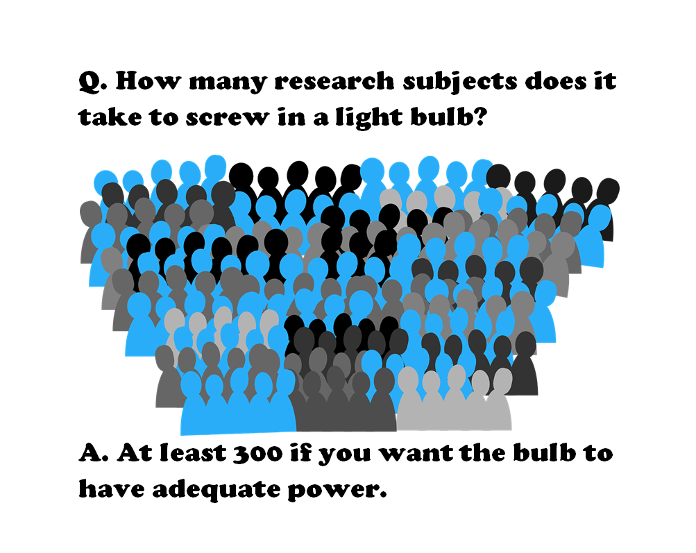
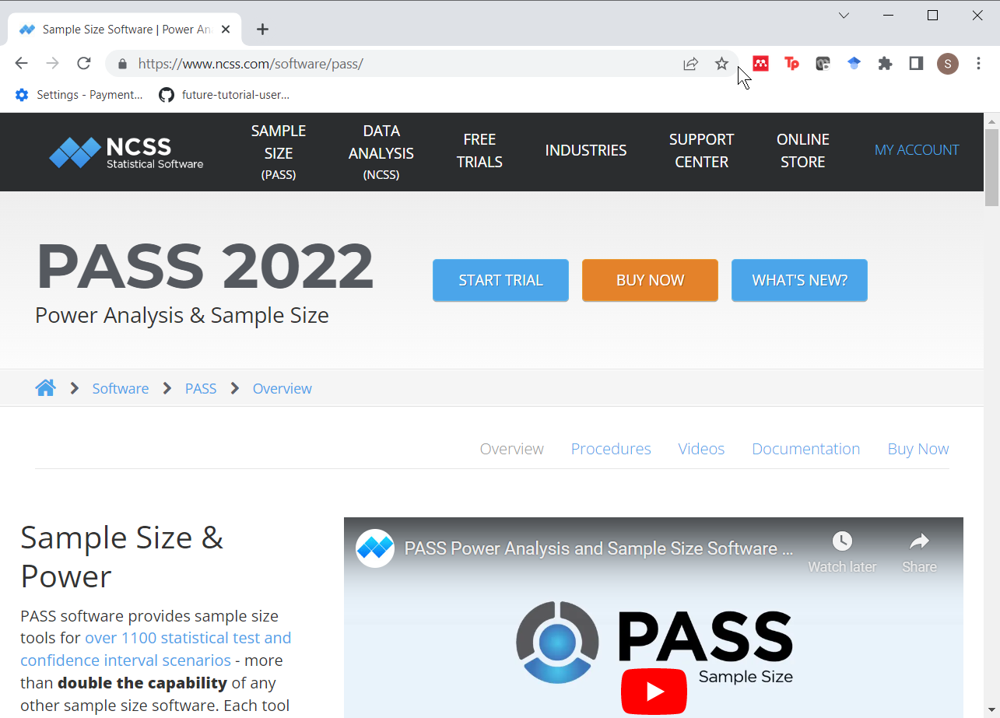
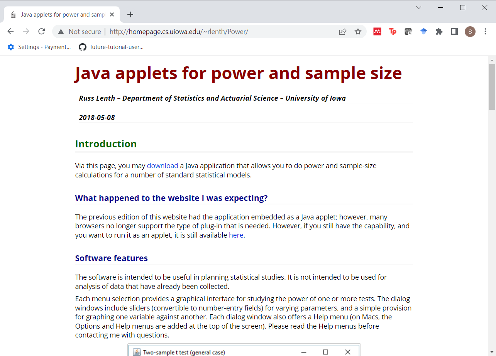
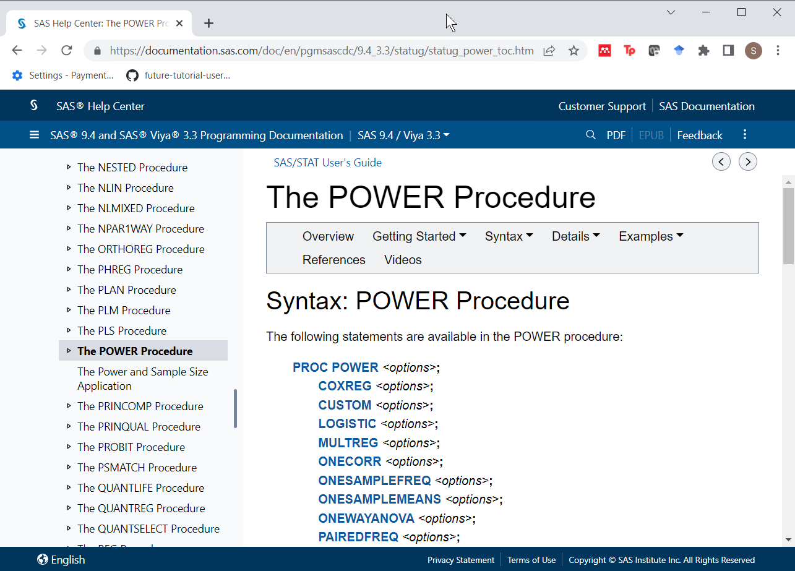

```{r setup, echo=FALSE}
knitr::opts_chunk$set(
  echo=TRUE,
  message=FALSE,
  warning=FALSE)
suppressMessages(
  suppressWarnings(
    library(tidyverse)
  )
)
# Width and height of all graphs
w=6
h=3
```

### How many research subjects...



<div class="notes">

Here's a meme that I tried to create. It got sent to about a dozen people and fizzled out. Oh well. This is a take-off on the classic light bulb joke.

How many research subjects does it take to screw in a light bulb?

At least 300 if you want the bulb to have adequate power.

Actually, that 300 comes from an article on Schizophrenia that I'll talk about in a minute.

</div>

### Definitions

+ $H_0:\ \theta=\theta_0$
+ $H_1:\ \theta \ne \theta_0$
+ $Power = P[Reject\ H_0\ |\ \theta]$

<div class="notes">

Many applications in statistics specify two hypotheses about a population parameter. By tradition, the first hypothesis, H0 or the null hypothesis is a hypothesis with an equality and the second hypothesis, H1 or Ha or the alternative hypothesis is a hypothesis with an inequality.

Here I am using theta as a generic parameter, but usually the hypothesis involves population means represented by the Greek letter mu, population proportions represented by the Greek letter pi, or regression coefficients represented by the Greek letter beta.

</div>

### Three things that you need

+ To determine the appropriate sample size, you need
  + Research hypothesis
  + Standard deviation of your outcome measure
  + Minimum clinically important difference

<div class="notes">

I get a lot of questions about sample size, and what I typically need before I can do any calculations are three things.

First, I need a research hypothesis. Not every research study has a research hypothesis and I'll talk at the end about what you can do if you do not have a research hypothesis. But most studies do have a research hypothesis. Then I need a measure of variation, typically a standard deviation. If I can get a range, a standard error, a confidence interval, or an interquartile range, I can usually extrapolate. Finally, I need what is often called the minimum clinically important difference.

</div>

### Why are power and sample size calculations important?

+ Fictional research report
  + This is a new and innovative surgical approach and we are 95% confident that the cure rate is somewhere between 3% and 98%.
+ Thornley and Adams review
  + 2,000 studies
  + Target sample size=300
  + Average sample size=65
  + Only 3% met the target sample size
  
<div class="notes">

So to emphasize why power and sample size calculations are so important, I tell a fictional story about a researcher who gets a six-year, ten-million-dollar grant and writes up a final report that says "This is a new and innovative surgical approach and we are 95% confident that the cure rate is somewhere between 3% and 98%."

Even people who don't know much about Statistics get the point of this story. If the best confidence interval that you can produce goes from 3% to 98%, you've just wasted a lot of money. This is an example of where everything is nothing.

A real world example, though a bit dated, comes from a paper by Ben Thornley and Clive Adams that reviewed two thousand research papers on schizophrenia published between 1948 and 1997. They found several problems with most of these studies. They studied the wrong patients, they didn't study them long enough, and they didn't measure them consistently. But just as big a problem was that they did not study enough research subjects. Thornley and Adams did some "back of the envelope" calculations and established that a decent study of schizophrenia should recruit at least 300 patients. But the average study only recruited 65 patients. Even worse, was that only 3% of all the studies met or exceeded the target sample size of 300.

</div>

### Software to calculate power and sample size: PASS



<div class="notes">

There's a lot of good software out there to do power and sample size calculations. One product is PASS, which is an acronym for Power And Sample Size.

</div>

### Software to calculate power and sample size: PiFace



<div class="notes">

Another software program is PiFace. PiFace was written by Russ Lenth. Dr. Lenth recently retired from a teaching position at the University of Iowa. I wrote the first PhD disseration that Dr. Lenth supervised. That was back in 1982. Dr. Lenth got very interested in power and sample size calculations in the early 1990s and wrote some very nice apps. The most recent one, PiFace, is a Java program and it has lots of nice features, such as sliders that allow you to see directly the impact of various changes in sample size affects power or how various changes in power affect sample size.

</div>

### Software to calculate power and sample size: SAS Proc Power



<div class="notes">

I know it will make me unpopular with this audience, but SAS has a very nice set of power and sample size calculation software. It was written by Ralph O'Brien and John Castelloe. Dr. Castelloe wrote the second PhD dissertation that Dr. Lenth supervised. Ralph O'Brien had written some SAS macro programs for power and sample size calculation (UnifyPow) that got integrated into SAS under the name "proc power" with the help of Dr. Castelloe.

</div>

### Other software

+ nQuery advisor
+ G*Power
+ Power and Precision

<div class="notes">

There's a lot of other good software out there. Among the three listed here, I have used nQuery advisor and like it a lot. It was written by Janet Elashoff. She wrote an NIH grant a few years ago that said something along the lines of "Your review panels at NIH often have to cope with incomplete, inaccurate, or poorly documented power and sample size calculations. Give me a bit of money and I'll write some software that will help grant writers do better with these calculations."


</div>

### Software to calculate power and sample size: R

+ Program from scratch
  + qnorm
  + pt
+ stats library
  + power.t.test
  + Others (power.anova.test, power.prop.test)

<div class="notes">

I want to show three different approaches to sample size calculations. Two involve programming from scratch, but you may find the power.t.test function to be easier to work with.

</div>

### Independent samples t-test

+ $H_0:\ \mu_1 = \mu_2$
+ $H_1:\ \mu_1 \ne \mu_2$
  + Assume normal with known $\sigma$
+ Test statistic
  + $T = \frac{\bar{X}_1-\bar{X}_2}{\sigma \sqrt{\frac{2}{n}}}$
  + Reject $H_0$ if T > $z_{\alpha/2}$

<div class="notes">

A simple setting for power and sample size calculations is the comparison of two means. I am showing a two-sided hypothesis, but it is pretty easy to modify these calculations for a one-sided hypothesis.

You should really use a t-distribution here, but the calculations are a bit simpler if you you approximate the t-distribution with a normal (or Z) distribution. The problem when you are trying to estimate a sample size that provides a given power is that you have to account for changes in the degrees of freedom. If your total sample size is above 60, there is so little difference between the t and Z distributions, that you are probably safe.

But I will show some calculations later that incorporate the t-distribution.

</div>

### Approximate sample size for independent samples t-test (1/3)

+ Approximate formula
  + $\beta$=1-power
  + $n = \frac{2(z_{\alpha/2}+z_\beta)^2 \sigma^2}{(\mu_1-\mu_2)^2}$ 
  + $n = \frac{2(z_{\alpha/2}+z_\beta)^2}{ES^2}$ 
+ Simple modifications for
  + one-sided test
  + unequal group sizes
  + unequal variances

<div class="notes">

Here are the formulas for estimating sample size. If you have a one-sided test, the change in the formula is trivial. The change is less trivial for unequal group sizes and/or unequal variances, but the work is more tedious than difficult.

It's important to note here that the value of n is the number of observations in each group, not the sample size across both groups.

</div>

### Approximate sample size for independent samples t-test (2/3)

+ $\alpha=0.05$
+ $\beta=0.20$
  + $n = \frac{2(1.96+0.84)^2}{ES^2}$
  + $n = \frac{15.84}{ES^2}$
  + $n \approx \frac{16}{ES^2}$
  
<div class="notes">

An interesting side note is that if you use the most common values for alpha (0.05) and power (0.8, corresponding to a beta of 0.2), the sample size formula simplifies to approximately 16 divided by the effect size squared. So if you know the effect size is half a standard deviation, you can calculate a pretty good approximation in your head. Sixteen divided by 0.5 squared is 64. If the effect size is a ridiculously small one-tenth of a standard deviation, then a good approximation to the sample size is 1,600 per group. 

</div>

### Approximate sample size for independent samples t-test (3/3)

```{r}
alpha <- 0.05
beta <- 0.20
delta <- 20
sigma <- 40
ES <- delta/sigma
2*(qnorm(1-alpha/2)+qnorm(1-beta))^2/ES^2
```

<div class="notes">

Here's the actual sample size calculation using the qnorm function in R.

</div>

### Power for independent samples t-test (1/2)

+ Do NOT just change the Z's to t's
    + $n \ne \frac{2(t_{\alpha/2}+t_\beta)^2}{ES^2}$ 

+ Use non-central t distribution
  + Power = P[non-central t > central $t_{\alpha/2}$]
  + ncp = $ES\ \sqrt{n/2}$

<div class="notes">

You can calculate power more exactly using a t-distribution. But don't just replace the z's with t's. For one thing, you are trying to calculate the sample size per group, n, but n appears on both sides of the equation. It may not look like it, but the degrees of freedom for the t-distribution is implicitly a function of n.

There's an added complication. The correct sampling distribution of the test statistic under the alternative hypothesis is a non-central t-distribution and the non-central t-dsitribution is not simply a central t-distribution shifted to the left of the right.

What you have to do is to calculate power and then use trial and error to find a sample size that meets your target power.

Here is a formula for power. I skipped the precise mathematical formulation because it looks ugly, but that it represents is the probability that a non-central t-distribution exceeds a percentile of the central t-distribution.

The non-centrality parameter is a function of the sample size and the effect size. A larger sample size leads to a larger non-centrality parameter, which produces higher power. A smaller effect size leads to a smaller non-centrality parameter, which produces lower power.

Don't forget that n represents the sample size per group.

</div>

### Power for independent samples t-test (2/2)

```{r}
n <- 64
1-pt(
  qt(1-alpha, 126), 
  df=126, 
  ncp=ES*sqrt(n/2))
```

<div class="notes">

Here are the actual power calculations for a sample size of 64 per group and an effect size of 0.5.

</div>

### Using power.t.test (1/3)

```{r}
estimated_power <- 
  power.t.test(
    n=64, 
    delta=0.5, 
    sd=1, 
    sig.level=0.05, 
    power=NULL,
    type="two.sample",
    alternative="two.sided")
```

<div class="notes">

I like to derive the formulas from scratch, but that's just the mathematician in me. Most of the time, you can and should rely on built-in functions. R has several nice functions for power and sample size calculations.

The one that you use for a two-sample t-test is the power.t.test function, which is part of base R.

The nice thing about this function is that it can handle power calculations by setting the power argument to null. But it also does sample size calculations. Specify a value for power and let the argument n equal null. It could also calculate a difference in means that would produce a specified power for a specified sample size by setting delta to null.

</div>

### Using power.t.test (2/3)

```{r}
names(estimated_power)
```

<div class="notes">

The power.t.test function produces a list, and the key argument in the list is power. 
</div>

### Using power.t.test (3/3)

```{r}
estimated_power$power
estimated_power$note
```

<div class="notes">

Here is the estimated power.

You should also observe that the note argument produces a nice reminder that n is the sample size per group, not the total sample size across both groups.

</div>

### Additional functions and libraries  

+ Functions
  + power.prop.test
  + power.anova.test
+ Libraries  
  + Hmisc
  + pwr, pwr2
  + samplesize
  + Many others

<div class="notes">

There's a lot more that you can do with R. Base R has functions that can estimate power and sample size for a test of two proportions and for the analysis of variance setting.

There are also many libraries that are worth exploring.

</div>

### Simulation

+ From scratch
+ simglm library
+ Bayesian simulation using MCMC??

<div class="notes">

There is a recent trend in research to use Monte Carlo simulations in place of a simple power calculation. You can build a simulation from scratch. In fact, R is a wonderful package for running simulations. 

There's even a library that will run simulations for you in the setting of a generalized linear model.

One area of research I am interested in is Bayesian simulation of clinical trials using Markov Chain Monte Carlo.

But all of this is well beyond the scope of this talk.

</div>

### What if you have no hypothesis?

+ Descriptive study
  + Use CI width to estimate sample size
+ Focus groups
  + Saturation
+ Other qualitative studies
  + Use qualitative criteria

<div class="notes">

I should note that there are many research settings where there is no formal hypothesis test. No hypothesis test means no way to calculate power. So what do you do?

For some studies, you can use the width of the confidence interval to estimate sample size.

For focus groups, researchers often define sample size needs using a concept known as saturation. Saturation is the point at which the focus groups stop providing ideas and concepts other than those already mentioned by previous focus groups.

You can also rely on the fact that a qualitative study often uses qualitative criteria to determine an appropriate sample size.

</div>
