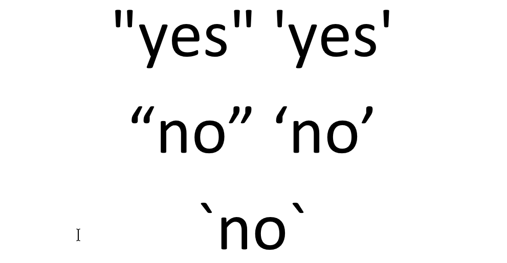
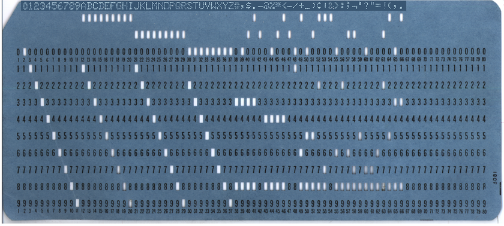
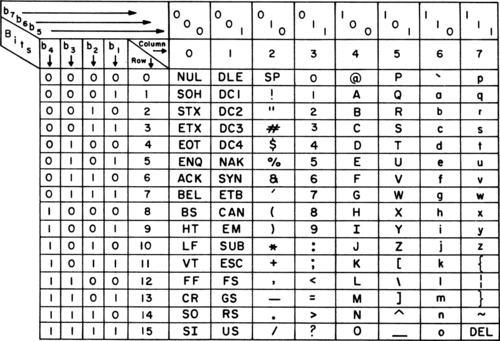

```{r setup, echo=FALSE}
knitr::opts_chunk$set(
  echo=TRUE,
  message=FALSE,
  warning=FALSE)
suppressMessages(
  suppressWarnings(
    library(tidyverse)
  )
)
suppressMessages(
  suppressWarnings(
    library(stringr)
  )
)
options(width=39)
```

### Overview

+ Definitions
+ Combining and splitting
+ Searching and Replacing
+ Regular expressions

<div class="notes">

Here's an outline of what I want to cover.

</div>

### Definitions

A string in R is data value that includes

+ letters,
+ numbers, and/or
+ symbols

Strings are also known as

+ alphanumeric,
+ character, or
+ text

<div class="notes">

A string is a data value that consists of letters (such as a person's name) or a mix of letters and numbers (such as a person's address). It can include special symbols and/or spaces.

</div>

### Use quotes to designate data as a string

```{r}
name <- 'Steve Simon'
work_address <- c(
  "School of Medicine",
  "2401 Holmes St.",
  "Kansas City, MO  64108")
```

### Do NOT use curly quotes or back quotes.



<div class="notes">

The quote marks that you should use are called straight quotes. These are the ones that appear in the first row of this image. Most of the time, you will get this by default, but once in a while some alternate quotes will sneak in. These are called curly quotes. These are shown in the second line of the image. With curly quotes, the ones on the left look different from the ones on the right. You might get these if your code or your dataset was prepared in a word processing program like Microsoft Word. They look nicer on the printed page than the straight quotes in the first line. But R will produce an error message if your string is surrounded by curly quotes.

The third line shows the back quote or the back tick. This is also not valid for strings.

</div>

### The evolution of computer characters

+ EBCDIC
+ ASCII
+ Unicode

<div class="notes">

Computers have to store various letters, numeric digits, and symbols on computers that place everything into binary, 0s and 1s.

The system of converting to binary is called encoding. There are many standards for encoding that have been used in the computer age. I want to talk about three dominant encoding standards: EBCDIC, ASCII, and Unicode.

</div>

### Extended Binary Coded Decimal Interchange Code (EBCDIC)



<div class="notes">

The first major standard for this was EBCDIC. This was developed for IBM mainframe computers and was a dominant standard in the 1950s and 60s.

The EBCDIC standard evolved in the 1950s as a way of digitizing computer punch cards for IBM mainframe computers. This was a dominant standard during the era of big mainframe computers. There are a few computer files where the strings are stored in EBCDIC, but these have mostly been replaced by the ASCII and Unicode standards.

</div>

### American Standard Code for Information Interchange (ASCII)



<div class="notes">

The ASCII standard was developed in the mid 1960s and became prominent around the time that personal computers became available. The original ASCII standard used 7 binary digits for a total of characters associated with the binary representations of 0 through 127. These included upper and lower case letters, numeric digits, special symbols, and some non-printing characters, such as the tab character.

</div>

### Seven bit ASCII

+ 00 through 7E
  + 00-1E unprintable control characters
  + 20-2E various symbols
  + 30-39 digits 0-9
  + 3A-40 various symbols
  + 41-5A capital letters (A-Z)
  + 5B-60 various symbols
  + 61-7A lower case letters (a-z)
  + 7B-7E various symbols

<div class="notes">


</div>

### Getting the numbers behind the code

"There are 10 types of programmers in the world, those who understand binary and those who don't."

+ Binary
  + Digits: 0, 1
  + $01000001_2=0\times2^7+1\times2^6+0\times2^5+...+1\times2^0=65$
  + $01111010_2=0\times2^7+1\times2^6+1\times2^5+...+0times2^0=122$
+ Hexadecimal
  + Digits: 0, 1, 2, 3, 4, 5, 6, 7, 8, 9, A, B, C, D, E, F
  + $41_{16}=4\times16^1+1\times16^0=65$
  + $7A_{16}=7\times16^1+10*16^0=122$
  
<div class="notes">

There's a joke rolling around on the Internet about programmers and binary numbers. Here's a quick review of binary numbers as well as hexadecimal numbers.

Binary numbers are computed using the sum of either 0 or 1 times descending powers of 2. So the binary 01000001 is 0 times 2 raised to the seventh power plus one times 2 raised to the sixth power, etc.


Hexadecimal uses powers of 16. There are no digits beyond 9, so you use A for 10, B for 11, and so forth through F for 15.

</div>

### This is an example of box drawing characters.


### Converting from hexadecimal to character

```{r}
"\x41"
"\x7A"
```

<div class="notes">

If you precede a hexadecimal number with a back slash x, that will display the character associated with that number.

</div>

### Converting from character to hexadecimal

```{r}
charToRaw("A")
charToRaw("z")
```

<div class="notes">

The charToRaw function, part of the base R package, will show you the hexadecimal representation of any single character.

</div>

### Eight bit ASCII

+ Characters for 80-EE
  + Accented letters (Ç é ì)
  + Math symbols (± ÷ ½ ¾)
  + Box drawing (╗ ╝)
  + Other alphabets (حاسوب)
+ No common standard
  + Code pages

<div class="notes">

Computers normally fetch and retrieve data in batches of 8 bits at a time. So stopping the characters at 7 bits seemed like a waste. Using the eighth bit would allow you to double the characters that could be represented. So programmers rushed to fill the gap. They started including accented letters, math symbols, and box drawing characters.

The box drawing characters require a bit of explanation. Early personal computers could not display arbitrary graphics. They could only display a limited character set on fixed locations on the screen. But the programmers of that day tried to craft a limited set of single line and double line characters to represent the sides and corners of various boxes. They used these boxes to surround important text messages. It all seems rather primitive now.

The problem with the eighth bit is that no one could agree on what the characters should be. So dozens of different standards appeared on scene and a text file that displayed a series of mathematical formulas on one system would get converted to a seemingly random set of accented characters on another system.

Each different 8 bit ASCII system was given a code page, a numeric designation that described what the characters were represented by numbers larger than 127.

The other problem was that many languages (Chinese, for example) required a lot more characters than could be displayed in 8 bits.

https://yihui.org/en/2018/11/biggest-regret-knitr/
https://danielmiessler.com/study/encoding/

https://en.wikipedia.org/wiki/Code_page

</div>

### Unicode

+ Unicode is a multilingual standard
  + Developed in 1990's.
  + Mix of 8 bits, 16 bits, 24 bits, and 32 bits
    + Compatible with 7 bit ASCII
  + Room for 160 thousand characters
    + 161 languages
    + Emojis
    + Extra symbols (curly quotes, em and en dashes)

<div class="notes">

In response to the problems with eight bit ASCII, an international consortium developed the Unicode standard in the 1990s. This standard has been widely adopted and allows easy representation of text in just about any language.

Unicode is a mixture of 8, 16, 24, and 32 bits. It is compatible with 7 bit ASCII and unifies all the varying 8 bit ASCII code pages.

</div>

### Using binary, octal, and hexadecimal codes

```{r}
"\x41"
"\101"
"\u41"
"\U41"
```

This was quickly extended to 8 binary digits, which provided 256 characters, but there were problems with standardization of the characters from 128 through 255.

In the

The 


The common standard for strings is ASCII, which is short for the American Standard for Information Exchange.

</div>

### Unicode
  + Mix of 8, 16, 24, and 32 bits
  + Support for all alphabets
  + Includes emoji symbols
  
### The ASCII standard

+ American Standard Code for Information Exchange
  + Supplants an earlier standard, EBCDIC.
+ 7 bit ASCII
  + Commonly agreed upon on all systems
+ 8 bit ASCII
  + Accented characters, math symbols, or box drawing characters
  + No standard
+ Unicode
  + Mix of 8, 16, 24, and 32 bits
  + Support for all alphabets
  + Includes emoji symbols
  
<div class="notes">

The common standard for strings is ASCII, which is short for the American Standard for Information Exchange.

</div>

### Designating special symbols


### A special vector of upper case ...

```{r}
LETTERS
```

<div class="notes">

R provides a vector of the individual letters of the English alphabet. LETTERS (all upper case) provides all the upper case letters.

</div>

### ... and lower case letters.

```{r}
letters
```

<div class="notes">

Use letters (all lower case) to get all the lower case letters.

</div>

### Break #1

What have you learned

+ Basic definitions

What's coming next

+ Combining and splitting

<div class="notes">

You just learned about strings, also known as alphanumeric, character, or text data. Next, you'll learn about how to combine and split strings. 

</div>

### The paste function

```{r}
first_name <- "Steve"
last_name <- "Simon"
paste(first_name, last_name)
paste(first_name, last_name, sep="_")
paste(last_name, first_name, sep=", ")
```

<div class="notes">

The paste function combines two or more strings into a single string. By default, it places a space between each string, but you can change this using the sep= argument.

</div>

### The paste0 function

```{r}
paste(LETTERS[1:3], 1, sep="")
paste0(LETTERS[1:3], 1)
```

<div class="notes">

Often you want to paste without using an delimiters. While this works with Use "paste", and a delimiter of quote-quote, this occurs often enough that R offers a helper function, paste0. A helper function is an adaptation of a a function with mutliple arguments to a simpler function where some of the arguments are pre-specified. For paste0, it is equivalent to paste, but with the sep= argument set to quote-quote.

</div>

### Collapsing a vector

```{r}
paste(LETTERS[1:3], collapse=", ")
```


<div class="note">

Sometimes you want to collapse all the strings in a vector to a single string.

</div>

### The tidyverse libraries for string manipulation

stringr

+ 

### The str_sub function

### The str_split function

### The glue function

```{r}

```

### Break #2

What have you learned

+ Combining and splitting

What's coming next

+ Searching and Replacing

Any questions?

<div class="notes">

Use the precip dataset for illustrations.

</div>

### Break #3

What have you learned

+ Searching and Replacing

What's coming next

+ Regular expressions

Any questions?

<div class="notes">


</div>

### Summary

+ Definitions
+ Combining and splitting
+ Searching and Replacing
+ Regular expressions

Any questions?

<div class="notes">

This talk covered a lot of topics. You saw some basic definitions for string data, looked at how to combine and separate strings, how to search and replace within strings, and had a brief introduction to regular expressions.

Any questions?

</div>